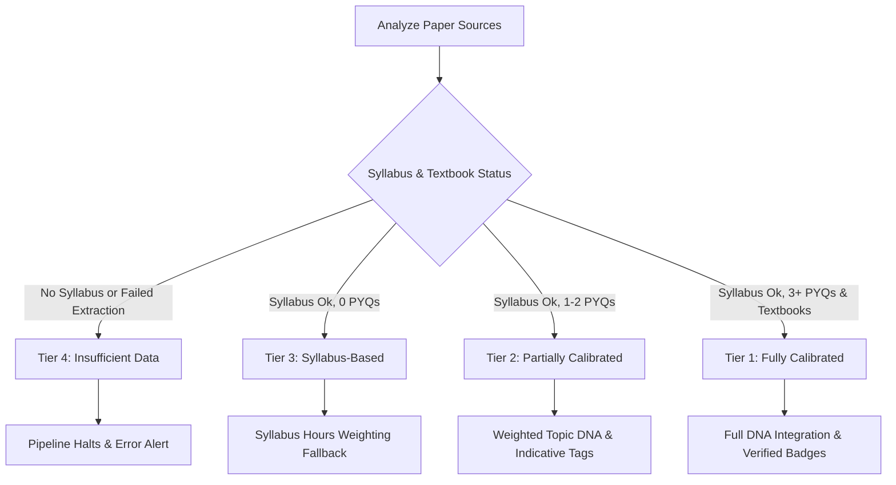

# StudyAI Master PRD (Product Requirements Document)

## 0. Current Project State & Folder Structure
This document serves as the master PRD, containing every detail from all original phases, updated with the current project state.

### Folder Structure
- `/backend`: Contains the FastAPI server, pipeline orchestrator, and database integration scripts.
  - `/backend/pipeline/agents`: Contains the 12 agent scripts (e.g., `agent_01_decoder.py`, `agent_05_writer.py`).
  - `/backend/pipeline/agent_03_paper_dna`: Handles the DNA extraction logic (structural, topical, linguistic).
  - `/backend/database`: Supabase client and queries.
  - `/backend/source_map` & `/backend/source_pdfs`: Data inputs.
- `/frontend`: Next.js 14 App Router application.
  - `/frontend/app`: Routes for `/paper/[upc]`, `/pipeline/[upc]`, `/reading/[upc]/[unitId]`.
  - `/frontend/components`: UI components organized by domain (`notes/`, `overview/`, `pipeline/`, `reading/`).
  - `/frontend/lib`: Core utilities including `parseField.ts` for handling complex JSON and formatting.
- `/prd`: Contains original phase PRDs (Phase 1-4) and UI design specs.

---


# --- CONTENTS FROM PRD_Phase1_Product_Strategy.md ---

# StudyAI — Product Requirements Document
## Phase 1: Product Strategy, Philosophy, Scope & Tech Stack

> **Document:** 1 of 3  
> **Who this is for:** Me. One developer. My own DU exams.  
> **Guiding principle:** This is not a startup. It is a personal power tool. No scaling, no auth, no deployment infra — just a precision pipeline that generates the best possible study notes for my specific papers, running on my own machine.  
> **Source authority:** Grounded exclusively in the actual codebase — `backend/`, `frontend/`, `PLAN/`, `.env`, `requirements.txt`, `package.json`, `upc_registry.json`  
> **Last sync:** Verified against all implementation files

---

## 1. What This Is (And What It Is Not)

### What it IS:
- A **local, personal AI pipeline** that takes my DU B.Sc. NEP 2022 paper code (UPC), reads my manually collected syllabus + PYQ PDFs, and generates the most exam-calibrated study notes possible
- A **12-agent system** that runs on my laptop (`localhost:8000` backend, `localhost:3000` frontend)
- Something I run **once per exam paper**, watch it process, and then study from the output
- A tool that gets **iteratively better** — I tune `writer_invariant.txt` and `critic_constitution.txt`, wipe the Supabase rows, and re-run until the notes are perfect for how DU actually asks questions

### What it is NOT:
- A product for other students
- Deployed anywhere — no cloud server, no Vercel, no Docker in production
- Multi-user — there is no authentication, no accounts, no session server
- Constantly running — I start it when I need it, it runs for one paper, I stop it

### The Single Most Important Fact:
> **I am the user. The quality of the notes determines if I pass my exams. Every architectural decision exists to serve that one goal.**

---

## 2. Current Live Paper

From `backend/source_map/upc_registry.json` — the only paper registered so far:

| Field | Value |
|---|---|
| **UPC** | `2352203601` |
| **Paper Name** | Probability and Statistics |
| **Paper Code** | DSC-3 |
| **Programme** | B.Sc. (H) Mathematics |
| **Semester** | 3 |
| **Paper Type** | `numerical` (mixed theory + heavy calculation) |
| **Documentation Tier** | `1` (fully documented — best case) |
| **PYQ Years Available** | `[2023]` |
| **Primary Textbook** | Devore, J.L. (2016) — Probability and Statistics for Engineering and the Sciences, 9th ed., Cengage |
| **Secondary Textbook** | Mood, Graybill & Boes (1974) — Introduction to the Theory of Statistics, 3rd ed., Tata McGraw-Hill |
| **Units** | 3 units — Descriptive Stats + Probability, Continuous Distributions, CLT + Regression |
| **Study Hours** | 15 hrs × 3 units = 45 hrs total |
| **Practical Component** | Yes — 30 hours software labs (Microsoft Excel) |

This is the test paper for the full end-to-end pipeline run. Everything is built and tuned around making these notes perfect first.

---

## 3. Core Product Philosophy — The Note Standard

> This is the most important section. Every agent, every prompt, every component is measured against this philosophy. If an agent's output doesn't serve this, it's wrong.

### 3.1 The Exam-Calibration Principle

I don't want "good notes." I want **notes that help me pass my DU exam**. The difference:

- Content depth is determined by **how many marks DU has historically awarded to this topic** and **exactly how the examiner phrases the question** — not by how interesting or comprehensive a topic feels
- Every definition I read must be **directly answerable in an exam setting** without needing external context
- Every PYQ reference must be **year-confirmed** — not guessed, not approximated
- Mathematical notation must be **consistent across the entire paper** so I'm not confused by different symbols in different units

### 3.2 The Note Standard — 8 Non-Negotiable Rules

These are hard rules encoded into the prompts and enforced by specific agents. If any of these fail, the output is wrong.

| # | Rule | Enforced By |
|---|---|---|
| 1 | Every definition must be DU-exam-answerable as a standalone sentence | Agent 5 (`writer_invariant.txt`) |
| 2 | Every analogy must be verifiable — `analogy_verified: bool` must be `true` or flagged | Agent 5 outputs the field; Agent 7 may flag it |
| 3 | PYQ year attributions require explicit source confirmation — `year_confirmed` + `year_confidence` fields | Agent 2C (PYQ Normaliser) sets these |
| 4 | Mathematical notation must be consistent across all topics in a paper | Agent 12 (Consistency Checker) — auto-fixes Unicode → LaTeX |
| 5 | No topic may reach `complete` status without passing through the Critic → Rewriter → Micro-Validator gate | Orchestrator enforces this sequence |
| 6 | `rapid_revision` block must exist for every topic — it is the last-minute study anchor | Agent 9B (Micro-Validator) checks this field exists |
| 7 | Content depth is driven by PYQ priority signal, not word count — `priority: high/medium/low/never_asked` | Topic DNA → Agent 5 writer injection |
| 8 | `flagged_fields` JSONB must surface to me when anything is uncertain | Agent pipeline writes flags; frontend renders them visibly |

### 3.3 Strict Architectural Separation

Three systems. Each has one job and must not bleed into the other.

```
┌─────────────────────────────────────────────────────────────┐
│  PIPELINE  (FastAPI + 12 Agents)                            │
│  → Write-only. Triggered once per UPC.                      │
│  → All output stored in Supabase. Nothing held in memory.   │
└───────────────────────────┬─────────────────────────────────┘
                            │ writes to
┌───────────────────────────▼─────────────────────────────────┐
│  DATABASE  (Supabase PostgreSQL)                             │
│  → Canonical source of truth.                               │
│  → Agents write ONLY via queries.py abstraction.            │
│  → No agent ever imports database.client.db directly.       │
└───────────────────────────┬─────────────────────────────────┘
                            │ reads from / subscribes to
┌───────────────────────────▼─────────────────────────────────┐
│  FRONTEND  (Next.js 16)                                      │
│  → Read-only during viewing. Pure renderer.                  │
│  → Never calls FastAPI after pipeline is triggered.          │
│  → Writes ONLY to field_flags and pyq_submissions tables.   │
└─────────────────────────────────────────────────────────────┘
```

---

## 4. The 4-Tier Documentation Trust Model

This determines what the pipeline can do with a paper based on what source material I've manually provided. It's set in `upc_registry.json` before running.

| Tier | Name | What I Have | Syllabus Confidence | Pipeline Behaviour | My Access |
|---|---|---|---|---|---|
| **1** | Fully Documented | Official syllabus PDF + ≥ 3 confirmed PYQ year PDFs | `high` | Full pipeline — all DNA + full PYQ coverage | Always unlocked |
| **2** | Partially Documented | Official syllabus + 1–2 PYQ years | `medium` | Full pipeline — PYQ coverage will have gaps | Always unlocked |
| **3** | Syllabus-Only | Syllabus PDF only, no PYQs | `low` | Runs in syllabus-based mode — no PYQ DNA | Requires PYQ submission unlock |
| **4** | Reconstructed | No official docs — reconstructed from course structure | `low` | Most speculative output | Requires PYQ submission unlock |

**Implementation in code:**
- `papers.documentation_tier INTEGER DEFAULT 2` — written by Agent 1 (Decoder) from `upc_registry.json`
- `papers.syllabus_confidence TEXT DEFAULT 'high'` — enum: `high/medium/low`
- Frontend gate: `frontend/lib/sessions.ts` → `isPaperUnlocked(upc, tier)` — Tier 1/2 always `true`; Tier 3/4 check `SessionData.unlockedPapers[]`

**My current paper (`2352203601`) is Tier 1** — best case, full pipeline runs with PYQ coverage enabled.

---

## 5. Scope — Exactly What I'm Building and Nothing More

### 5.1 In Scope (Personal v1.0)

- Running the pipeline locally for 1–2 exam papers at a time
- Triggering via `POST /generate` with a UPC → 12-agent pipeline runs → notes appear in browser
- Watching pipeline progress live (Supabase Realtime on `units` + `topics` tables)
- Reading the final notes in a clean Next.js UI with KaTeX math rendering
- Flagging fields I think are wrong (up to 10 per paper — stored in `field_flags` table)
- Uploading PYQ PDFs I find myself (stored in `pyq_submissions` — for Tier 3/4 unlock)
- Force-reruns: `POST /generate/rerun` with `from_agent: N` — wipe and re-run from any agent
- Iterative prompt tuning: edit `writer_invariant.txt` → `reset_db.py` → re-run → better notes
- Exporting notes as PDF for offline revision (via `html2canvas`)

### 5.2 Explicitly Not Building (v1.0)

| What | Why Not |
|---|---|
| User authentication / accounts | It's just me |
| Production deployment (Vercel, Docker, AWS) | Runs locally on my machine |
| Multi-paper parallel runs | One paper at a time is all I need |
| Admin dashboard | I check the terminal log directly |
| Hindi content generation | Reserved column in DB, not implemented yet |
| Vector similarity search | pgvector installed but unused |
| Temporal workflow orchestration | Not needed for local personal use |
| Syllabus change detection | Reserved table, logic not built |
| Scaling / rate limiting for multiple users | There are no other users |
| CI/CD pipelines | I run `uvicorn main:app --reload` myself |

---

## 6. Tech Stack

### 6.1 Backend — Python / FastAPI

I run this from `cd backend && uvicorn main:app --reload --port 8000`.

| Component | Technology | Version Constraint | What It Does |
|---|---|---|---|
| Language | Python | 3.11+ | All backend logic |
| API Framework | FastAPI | latest | 4 REST endpoints + background task execution |
| ASGI Server | Uvicorn | latest | Serves the FastAPI app locally with hot-reload |
| PDF Extract (Primary) | PyMuPDF (`fitz`) | ≥ 1.24.0 | Fast text extraction from syllabus + PYQ PDFs |
| PDF Extract (Fallback) | pdfplumber | ≥ 0.11.0 | Table/layout extraction when fitz is insufficient |
| Schema Validation | jsonschema | ≥ 4.22.0 | Validates every agent JSON output against its schema |
| Retry Decorator | tenacity | ≥ 8.2.0 | Decorator-based retry for fragile API calls |
| Env Management | python-dotenv | ≥ 1.0.0 | Loads `backend/.env` on startup |
| Database Client | supabase-py | ≥ 2.4.0 | All Supabase reads/writes via PostgREST |

**The 4 API Endpoints (all I need):**

```
POST /generate              → 202 Accepted — kicks off full 12-agent pipeline as BackgroundTask
GET  /status/{upc}          → Returns current pipeline_status + per-unit statuses (fallback poll)
POST /generate/rerun        → 202 Accepted — force re-runs from agent N, clears downstream DB data
GET  /health                → {"status": "ok"} — sanity check
```

**CORS:** Locked to `http://localhost:3000` only. This is never exposed to the internet.

**Duplicate run guard:** `_active_runs: set[str]` in memory — if I accidentally submit the same UPC twice, returns `409 Conflict` instead of running two parallel pipelines.

---

### 6.2 Frontend — Next.js / React

I run this from `cd frontend && npm run dev` (Turbopack).

| Component | Technology | Version | What It Does |
|---|---|---|---|
| Framework | Next.js | ^16.2.6 | App Router, React Server Components, Turbopack |
| Language | TypeScript | ^5 | All frontend code typed |
| UI Runtime | React | ^19.0.0 | Component rendering |
| Styling | Tailwind CSS | ^3.4.17 | Utility-first styling |
| Animation | Framer Motion | ^12.38.0 | Topic card animations, progressive reveal transitions |
| Math Rendering | KaTeX + react-katex | ^0.16.15 / ^3.0.1 | All LaTeX formulas rendered inline + block |
| DB Client (Browser) | @supabase/supabase-js | ^2.105.4 | Direct Supabase reads + Realtime subscriptions |
| DB Client (SSR) | @supabase/ssr | ^0.10.3 | SSR-safe Supabase client for server components |
| Data Fetching | @tanstack/react-query | ^5.100.10 | Server state, caching, background refetch |
| Icons | lucide-react | ^1.16.0 | UI icons throughout |
| PDF Export | html2canvas | ^1.4.1 | Lets me export rendered notes as PDF |
| Class Utilities | clsx + tailwind-merge | ^2.1.1 / ^2.5.5 | Conditional class merging without conflicts |

**The 3 Routes (all I need):**

```
/                     → Home — I type my UPC here, hit Generate
/pipeline/[upc]/      → Live view — shows pipeline running, unit-by-unit progress
/paper/[upc]/         → The notes — fully rendered study document, this is what I study from
```

**Session (no auth — it's just me):**

My browser gets a UUID stored in `localStorage` under `studyai_session_id`. The `SessionData` object (`studyai_session_data`) tracks:
- `flagCounts: Record<upc, number>` — how many fields I've flagged on this paper (max 10)
- `flaggedPapers: string[]` — which papers I've flagged
- `unlockedPapers: string[]` — Tier 3/4 papers I've unlocked via PYQ submission

This is entirely client-side. SSR returns a placeholder UUID — no server session.

---

### 6.3 Database — Supabase / PostgreSQL

I use the free Supabase tier. I have one project. All pipeline data goes into it.

| Component | Technology | Purpose |
|---|---|---|
| Database | PostgreSQL 15+ (via Supabase) | All persistent agent output data |
| REST API | Supabase PostgREST | How supabase-py and the JS client read/write |
| Realtime | Supabase Realtime (WebSocket) | Frontend subscribes to `units` + `topics` changes live |
| Extension | pgvector | Installed, not used in v1.0 |
| Auth | None | No RLS, no auth — free tier, personal project |

**The 10 Tables at a Glance:**

| Table | Who Writes | Who Reads | What It Stores |
|---|---|---|---|
| `papers` | Agents 1–3 | Frontend (read) | One row per UPC — all metadata, Paper DNA blob, pipeline status |
| `units` | Agents 2, 9–12 | Frontend (Realtime) | One row per unit — status, conceptual_summary, unit_closer |
| `topics` | Agents 5–12 | Frontend (read) | One row per topic — ALL content fields (20+ JSONB + text columns) |
| `problem_sets` | Reserved | Frontend | Worked problem sets per unit |
| `formula_sheets` | Reserved | Frontend | Formula/diagram/key-terms reference per unit |
| `pyq_submissions` | Frontend (write) | Backend (future) | PYQs I upload myself — for Tier 3/4 unlock rewards |
| `syllabus_change_log` | Reserved | Reserved | Detected syllabus hash changes — not built yet |
| `field_flags` | Frontend (write) | Reserved | Fields I've flagged as wrong/uncertain |
| `sessions` | Reserved | Reserved | Server-side session tracking — not used yet |
| `session_paper_views` | Reserved | Reserved | Paper access tracking — not used yet |

**Access Pattern — The Hard Rule:**
- **Backend writes:** ONLY through functions in `backend/database/queries.py`. No agent ever calls `db.table(...)` directly.
- **Frontend reads:** Direct Supabase JS client. No calls to FastAPI during viewing.
- **Frontend writes:** Only to `field_flags` and `pyq_submissions`.

**Realtime Subscriptions (what makes progressive rendering work):**

```typescript
// When I open /pipeline/[upc]/, these channels are opened:
subscribeToUnitStatus(upc, onUpdate)
  → channel: `units:upc:${upc}`
  → event: postgres_changes INSERT/UPDATE
  → filter: upc=eq.{upc}
  → triggers: unit card appears/updates in my browser

subscribeToTopicStatus(unitId, onUpdate)
  → channel: `topics:unit_id:${unitId}`
  → event: postgres_changes INSERT/UPDATE
  → filter: unit_id=eq.{unitId}
  → triggers: individual topic sections populate as they complete
```

---

### 6.4 AI Provider Stack and Routing Strategy

This is the most important infrastructure decision. Each provider is free at the tier I'm using. Provider selection is based on **what kind of reasoning the task requires**, not cost.

#### 6.4.1 The Four Providers

| Provider | Model | What It's Good At | My Free Tier Limit |
|---|---|---|---|
| **Google AI Studio** | `gemini-2.0-flash` | Fast, large context, excellent instruction-following — primary workhorse | ~15 RPM (free) |
| **Google AI Studio** | `gemini-2.5-pro` | Deep multi-document reasoning — for complex extraction tasks | ~5 RPM (free, strict) |
| **Groq** | `llama-3` | Extremely fast, high throughput — for binary/structural/verification tasks | ~30 RPM (generous) |
| **Cerebras** | Cerebras inference | Ultra-fast numerical reasoning — for math step verification | ~15 RPM |

> **Why multiple providers?** Not for redundancy — for capability matching. Gemini 2.5 Pro for deep syllabus extraction. Flash for creative note-writing. Groq for fast binary checks. Cerebras for math proofs. Using the wrong provider on the wrong task wastes capacity and produces worse output.

#### 6.4.2 Exact Agent → Provider → Model Routing Table

| Agent | # | Provider | Model | Why This Provider |
|---|---|---|---|---|
| Decoder | 1 | **None** | — | Pure JSON registry lookup — no AI needed |
| Researcher | 2 | **Gemini 2.5 Pro** | `gemini-2.5-pro` | Reading a dense PDF syllabus, extracting structured units/topics JSON — needs deep reasoning |
| Researcher Verifier | 2B | **Groq** | `llama-3` | Binary pass/fail on extracted JSON — fast, no creativity needed |
| PYQ Normaliser | 2C | **Groq** | `llama-3` | Structured normalization of raw PYQ text — high throughput, deterministic |
| Paper DNA — Structural | 3 | **None** | — | Rule-based stats from normalized PYQ JSON — pure Python, no AI |
| Paper DNA — Topic + Language | 3 | **Gemini 2.0 Flash** | `gemini-2.0-flash` | Single combined Flash call → returns `topic_dna[]` + `language_dna[]` arrays |
| Paper DNA — Combination | 3 | **Gemini 2.0 Flash** | `gemini-2.0-flash` | Second Flash call — topic co-occurrence + examiner combination patterns |
| Mental Model Mapper | 4 | **Gemini 2.0 Flash** | `gemini-2.0-flash` | Dependency graph construction + topic sequence optimisation across all units |
| Writer | 5 | **Gemini 2.0 Flash** | `gemini-2.0-flash` | **The most important call.** One call per topic. Largest context. Writes the actual notes I study from |
| Coverage Checker | 6 | **Groq** | `llama-3` | Fast cross-reference: output JSON vs syllabus JSON — structural check, not creative |
| Verifier | 7 | **Cerebras** | Cerebras | Step-by-step proof/numerical verification — ultra-low latency for math checks |
| Critic | 8 | **Gemini 2.0 Flash** | `gemini-2.0-flash` | Quality critique — must understand the note deeply to produce surgical JSON diffs |
| Rewriter | 9 | **Gemini 2.0 Flash** | `gemini-2.0-flash` | Applies Critic diffs — targeted field-level rewrites |
| Micro-Validator | 9B | **Groq** | `llama-3` | Validates the rewrite didn't regress — fast binary check |
| Final Examiner | 10 | **Gemini 2.0 Flash** | `gemini-2.0-flash` | Compares unit content against PYQ question list — marks what's missing |
| Patcher | 11 | **Gemini 2.0 Flash** | `gemini-2.0-flash` | Adds missing PYQ coverage + fills incomplete fields |
| Post-Patch Regen | 11B | **Gemini 2.0 Flash** | `gemini-2.0-flash` | Regenerates `rapid_revision`, `quick_checks`, `conceptual_summary` after patching |
| Consistency Checker | 12 | **Groq** | `llama-3` | Paper-level notation/definition/year consistency audit — fast, deterministic rules |

**Net Flash calls per topic (worst case):** Agent 5 (1) + Agent 8 (1) + Agent 9 (1) + Agent 10 (1) + Agent 11 (1) + Agent 11B (1) = **6 Flash calls per topic**. My `BSCMT201` style paper with ~12 topics across 3 units = ~72 Flash calls total — well under the 120-call kill switch.

#### 6.4.3 Concurrency Control — How Parallelism is Gated

All concurrency is managed by `asyncio.Semaphore` — **no threading semaphores, no `time.sleep()`** (these would block the entire event loop and kill parallelism).

Semaphores are created lazily inside the running uvicorn event loop via `rate_limiter.py`:

| Semaphore | Provider | Max Concurrent | Where Defined |
|---|---|---|---|
| `_FLASH_SEM` | Gemini 2.0 Flash | **5** | `orchestrator.py` line ~95 |
| `_PRO_SEM` | Gemini 2.5 Pro | **2** | `orchestrator.py` line ~96 |
| `_GROQ_SEM` | Groq Llama 3 | **3** (orchestrator) / 8 (rate_limiter max) | `orchestrator.py` line ~97 |
| `_CEREBRAS_SEM` | Cerebras | **3** | `orchestrator.py` line ~98 |

> **Note:** `rate_limiter.py` defines `groq: 8` as the theoretical maximum. `orchestrator.py` uses `_GROQ_SEM = asyncio.Semaphore(3)` as the actual operating limit. The orchestrator value governs runtime.

#### 6.4.4 Exponential Backoff Specification

Implemented in `backend/utils/rate_limiter.py` → `with_backoff()`:

| Parameter | Value |
|---|---|
| Base delay | `2.0 seconds` |
| Max delay cap | `60.0 seconds` |
| Max retry attempts | `5` |
| Jitter | `random.uniform(0, delay × 0.3)` added per retry |
| Backoff growth | `delay = min(delay × 2, 60.0)` each attempt |
| Triggers | `"429"`, `"rate limit"`, `"too many requests"`, `"ratelimit"`, `"quota"` (case-insensitive) |

**Important:** `with_backoff()` handles retry logic only. The caller must acquire the semaphore first (`async with _FLASH_SEM:`). The backoff function never re-acquires the semaphore on retry.

#### 6.4.5 The Cost Kill-Switch

From `backend/utils/cost_tracker.py`:

| Limit | Value | Behaviour on Breach |
|---|---|---|
| Max API calls per pipeline run | **120 calls** | Raises `CostKillSwitchError` immediately |
| Max estimated cost per run | **$8.00 USD** | Raises `CostKillSwitchError` immediately |
| Warning threshold | **$5.00 USD** | Logs a warning, continues running |

**All current providers are free** — cost is always `$0.00`. The call-count limit (120) is the real guard. If something goes wildly wrong and agents start looping, the kill-switch stops it at 120 calls.

**On `CostKillSwitchError`:** `pipeline_status` is set to `"partial"` (not `"failed"`). This means any units already completed remain fully readable in my browser. The pipeline stops gracefully.

**Tracking fields per API call:** `agent`, `model`, `input_tokens`, `output_tokens`, `latency_ms`, `success: bool`, `retry_count`, `estimated_cost_usd`, `timestamp`

---

## 7. Pipeline Status State Machine

These are the exact status values written to Supabase by `orchestrator.py`. My frontend Realtime subscriptions trigger on every change.

### 7.1 Paper Level (`papers.pipeline_status`)

```
queued
  └─→ generating
         ├─→ complete          ← Happy path — I can read all notes
         ├─→ failed            ← Pipeline halted (PipelineHaltError)
         └─→ partial           ← Cost kill-switch or unexpected crash — completed units still readable
```

### 7.2 Unit Level (`units.status`)

```
queued
  └─→ generating               ← Writer is running on this unit's topics
         └─→ verifying         ← Coverage Checker, Verifier, Critic running
                ├─→ complete   ← All topics done, unit summary generated
                └─→ failed     ← Retried up to MAX_UNIT_RESUME_ATTEMPTS = 3 times, then failed
```

### 7.3 Topic Level (`topics.status`)

```
queued
  └─→ generating               ← Writer (Agent 5) is running
         ├─→ complete           ← Writer + Critic + Rewriter + Micro-Validator all passed
         └─→ failed             ← Writer retried MAX_WRITER_RETRIES = 3 times, then failed
```

---

## 8. Retry Budget

How many times each agent will attempt before giving up or escalating:

| Agent / Gate | Max Attempts | What Happens on Exhaustion |
|---|---|---|
| Researcher (Agent 2) | 2 | `_PipelineHaltError` — syllabus extraction critical |
| Researcher Verifier (2B) | 2 | `_PipelineHaltError` — cannot proceed without verified syllabus |
| PYQ Normaliser (2C) | 2 per PDF | Skips that PYQ file, logs warning, continues |
| Paper DNA — Topic/Language (3) | 2 | Uses empty DNA, logs warning, continues |
| Paper DNA — Combination (3) | 2 | Uses empty combination, logs warning, continues |
| Mapper (Agent 4) | 2 | Falls back to fully sequential topic processing |
| **Writer (Agent 5)** | **3** (`MAX_WRITER_RETRIES`) | Sets topic `status = "failed"`, raises exception |
| **Unit Resume** | **3** (`MAX_UNIT_RESUME_ATTEMPTS`) | Unit marked `failed`, pipeline continues with other units |
| Verifier (Agent 7) | 2 (`MAX_VERIFIER_RETRIES`) | Uses empty verify result, topic continues to Critic |
| Critic (Agent 8) | 2 (`MAX_CRITIC_RETRIES`) | Topic proceeds uncorrected (skips Rewriter) |
| Micro-Validator (9B) | 2 | Retains pre-rewrite value (safe fallback) |
| Final Examiner (Agent 10) | 2 (`MAX_EXAMINER_RETRIES`) | Uses empty examiner output, skips to summary |
| Patcher (Agent 11) | 2 (`MAX_PATCHER_RETRIES`) | No patch applied, logs warning |
| Exponential backoff (all) | 5 per API call | Raises last exception |

---

## 9. Observability — What I Can See

v1.0 uses Python's built-in `logging` module only. This is all I need for personal use.

**Terminal output** (where I watch the pipeline run):

| Logger Namespace | Level | What It Prints |
|---|---|---|
| `studyai.main` | `INFO` | Pipeline queued/started messages |
| `studyai.orchestrator` | `INFO/WARNING/ERROR` | Phase A/B/C progress, agent completions, failures |
| `studyai.db` | `INFO` | Every status transition written to Supabase |
| `studyai.cost` | `DEBUG/WARNING` | Per-call token counts + cumulative cost |
| `rate_limiter` | `WARNING` | Rate limit hits + backoff delays |

**Log format:** `HH:MM:SS  LEVEL    namespace  message`

**Pipeline run log:** Output is also written to `backend/pipeline_run.log` (18 KB from the last full run — real data, not mock).

**Cost summary at end of run:**
```
Cost summary for 2352203601
  Total calls : 73
  Total cost  : $0.0000
  By agent:
    writer                         calls=12  cost=$0.0000
    critic                         calls=12  cost=$0.0000
    ...
```

**Rate limiter stats** (callable during runtime, not yet exposed as API):
```python
from utils.rate_limiter import get_stats
get_stats()
# → {"requests": {"gemini_flash": 72, "groq": 18}, "failures": {"groq": 2}}
```

---

## 10. Complete Folder Structure Reference

### 10.1 Backend (`backend/`)

```
backend/
│
├── .env                                    ← API keys (GEMINI, GROQ, CEREBRAS, SUPABASE_URL, SUPABASE_KEY)
├── main.py                                 ← FastAPI app: /generate, /status/{upc}, /generate/rerun, /health
├── requirements.txt                        ← All Python deps: gemini SDK, groq, pymupdf, pdfplumber, supabase, jsonschema, tenacity, dotenv
├── pipeline_run.log                        ← Log file from last full pipeline execution (18 KB)
│
├── ── Dev/Debug Scripts ──
├── audit_agents.py                         ← Scans all agent files, verifies run() signatures match orchestrator calls
├── fix_all_agents.py                       ← Auto-patches agent files with correct run() wrappers
├── patch_writer.py                         ← Targeted hot-patch script for agent_05_writer.py
├── test_signatures.py                      ← Runs signature verification tests
├── reset_db.py                             ← Wipes Supabase rows for a UPC (used between tuning iterations)
│
├── pipeline/
│   ├── orchestrator.py                     ← 836-line async engine: Phase A → B → C, semaphores, resume logic, kill-switch
│   ├── phase5_pipeline.py                  ← Standalone test runner for Phase B (Agents 5–9B only)
│   │
│   ├── agents/
│   │   ├── __init__.py                     ← Exposes all agents so orchestrator can do `from pipeline.agents import agent_05_writer as writer`
│   │   │
│   │   ├── agent_01_decoder.py             ← Reads upc_registry.json → writes papers row to Supabase
│   │   ├── agent_02_researcher.py          ← Reads syllabus.pdf → Gemini 2.5 Pro → structured syllabus JSON
│   │   ├── agent_02b_researcher_verifier.py ← Groq binary pass/fail on syllabus JSON (11.5 KB)
│   │   ├── agent_02c_pyq_normaliser.py     ← Groq normalises raw PYQ text → structured JSON (12 KB)
│   │   │
│   │   ├── agent_03_paper_dna/             ← 4 sub-modules for the Paper DNA analysis
│   │   │   ├── structural_dna.py           ← Rule-based stats (no AI): mark distribution, instruction words, PYQ patterns
│   │   │   ├── topic_dna.py                ← Gemini Flash: topic frequency + priority across PYQ years
│   │   │   ├── language_dna.py             ← Gemini Flash (combined with topic): instruction word patterns
│   │   │   └── combination_dna.py          ← Gemini Flash: topic co-occurrence + examiner combo patterns
│   │   │
│   │   ├── agent_04_mental_model_mapper.py ← Gemini Flash: dependency graph, optimised sequence, concept bridges (18 KB)
│   │   ├── agent_05_writer.py              ← Gemini Flash: full note writer per topic — THE core agent (42 KB)
│   │   ├── agent_06_coverage_checker.py    ← Groq: syllabus vs output cross-reference per unit (9 KB)
│   │   ├── agent_07_verifier.py            ← Cerebras: proof + numerical step verification (18.6 KB)
│   │   ├── agent_08_critic.py              ← Gemini Flash: quality critique → diff_schema JSON output (13 KB)
│   │   ├── agent_09_rewriter.py            ← Gemini Flash: applies Critic diffs per field (12 KB)
│   │   ├── agent_09b_micro_validator.py    ← Groq: validates rewrite didn't regress (10.8 KB)
│   │   ├── agent_10_final_examiner.py      ← Gemini Flash: PYQ coverage audit per unit (11.6 KB)
│   │   ├── agent_11_patcher.py             ← Gemini Flash: adds missing PYQs + field patches (13.4 KB)
│   │   ├── agent_11b_post_patch_regen.py   ← Gemini Flash: regen rapid_revision, quick_checks, conceptual_summary (9.7 KB)
│   │   └── agent_12_consistency_checker.py ← Groq: cross-topic notation/definition/year consistency (16.8 KB)
│   │
│   ├── prompts/
│   │   ├── researcher.txt                  ← Syllabus extraction instructions (38 bytes — minimal, logic in schema)
│   │   ├── paper_dna_topic.txt             ← Topic DNA + Language DNA combined prompt (6 KB)
│   │   ├── paper_dna_language.txt          ← Language pattern prompt (supplementary to topic DNA)
│   │   ├── mapper.txt                      ← Mental model mapping + dependency ordering prompt (6.8 KB)
│   │   ├── writer_invariant.txt            ← THE NOTE STANDARD — core writer rules that never change (13.7 KB)
│   │   ├── writer_variant.py               ← Dynamic prompt builder — injects topic DNA + bridges per call (13.5 KB)
│   │   ├── proof_verifier.txt              ← Constitution for proof/step verification (4.2 KB)
│   │   ├── critic_constitution.txt         ← "What makes a DU exam note good or bad" — the Critic's bible (4.2 KB)
│   │   ├── coverage_checker.txt            ← Coverage audit instructions (1.8 KB)
│   │   ├── final_examiner.txt              ← PYQ coverage check prompt (2 KB)
│   │   ├── patcher.txt                     ← Patch generation instructions (3.6 KB)
│   │   └── consistency_checker.txt         ← Cross-topic consistency rules (2.6 KB)
│   │
│   └── schemas/
│       ├── topic_schema.json               ← THE most critical schema — full topic output structure (15.8 KB)
│       ├── paper_dna_schema.json           ← Paper DNA blob validation (5.5 KB)
│       ├── diff_schema.json                ← Critic diff output format (1.6 KB)
│       ├── critic_diff_schema.json         ← Critic diff variant (1 KB)
│       └── unit_schema.json                ← Unit-level output schema (4.3 KB)
│
├── database/
│   ├── client.py                           ← Supabase client singleton (`db`) — imported only by queries.py
│   ├── queries.py                          ← ALL database operations — 304 lines, single source of truth
│   └── migrations/
│       └── 001_initial_schema.sql          ← Complete 10-table schema — run once in Supabase SQL editor
│
├── utils/
│   ├── cost_tracker.py                     ← API spend tracker + 120-call kill switch (134 lines)
│   ├── rate_limiter.py                     ← Async semaphores + exponential backoff (150 lines)
│   ├── cycle_detector.py                   ← Prevents infinite loops in topic prerequisite graphs (13 KB)
│   ├── latex_formatter.py                  ← Unicode math → LaTeX auto-correction rules
│   ├── depth_signal.py                     ← Topic depth signal source classifier (pyq/cbcs_estimate/syllabus_hours)
│   ├── pdf_detector.py                     ← PDF type detection (scanned vs digital)
│   ├── svg_library.py                      ← SVG diagram library reference
│   ├── textbook_resolver.py               ← Maps topic to prescribed textbook section
│   └── tier_classifier.py                  ← Documentation tier classification logic
│
├── source_map/
│   ├── upc_registry.json                   ← Manual registry: UPC → paper metadata (department, textbooks, units, tier)
│   ├── master_source_map.json              ← Reserved: master cross-paper source index
│   └── textbook_registry.json              ← Reserved: textbook metadata registry
│
└── source_pdfs/
    └── {upc}/
        ├── syllabus.pdf                    ← Official DU syllabus PDF — I download this manually
        └── pyq_{year}.pdf                  ← Previous year question papers — I collect these manually
```

### 10.2 Frontend (`frontend/`)

```
frontend/
│
├── package.json                            ← All deps: Next.js 16, React 19, Tailwind 3, KaTeX, Framer Motion, Supabase, TanStack Query
├── next.config.ts                          ← Next.js config
├── tailwind.config.ts                      ← Tailwind config
├── tsconfig.json                           ← TypeScript config
├── postcss.config.js                       ← PostCSS / Autoprefixer
├── .env.local                              ← NEXT_PUBLIC_SUPABASE_URL + NEXT_PUBLIC_SUPABASE_ANON_KEY
├── .env.example                            ← Template showing required env vars
│
├── app/                                    ← Next.js App Router
│   ├── layout.tsx                          ← Root layout — font loading, metadata, QueryClientProvider wrapper
│   ├── page.tsx                            ← Home: UPC input form → POST /generate → route to /pipeline or /paper
│   ├── globals.css                         ← Global base styles
│   ├── providers.tsx                       ← TanStack Query client provider
│   │
│   ├── paper/
│   │   └── [upc]/
│   │       └── page.tsx                    ← Full study notes view — reads completed data from Supabase
│   │
│   └── pipeline/
│       └── [upc]/
│           └── page.tsx                    ← Live pipeline monitor — Realtime subscriptions, progressive topic reveal
│
├── components/
│   ├── notes/                              ← 15 components — one per topic content field (see PRD Phase 3)
│   │
│   ├── pipeline/                           ← Pipeline progress UI components
│   │
│   └── ui/                                 ← 6 shared utility UI components (see PRD Phase 3)
│
├── lib/
│   ├── supabase.ts                         ← Supabase browser client singleton (461 bytes)
│   ├── queries.ts                          ← All reads, Realtime subscriptions, field flag + PYQ submission writes (195 lines)
│   ├── sessions.ts                         ← Session UUID, flag rate limiting, Tier 3/4 unlock logic (148 lines)
│   └── katex.ts                            ← KaTeX rendering helpers, LaTeX detection, safe render wrapper (2.5 KB)
│
└── types/
    └── database.ts                         ← TypeScript interfaces: Paper, Unit, Topic, FormulaSheet, ProblemSet, PYQSubmission
```

---

## 11. My Personal Iteration Workflow

This is the actual loop I run to make the notes better:

```
1. Tune writer_invariant.txt or critic_constitution.txt
         ↓
2. python reset_db.py  (wipes all rows for my UPC)
         ↓
3. curl -X POST localhost:8000/generate -d '{"upc": "2352203601"}'
         ↓
4. Open localhost:3000/pipeline/2352203601  — watch it run live
         ↓
5. Read the notes at localhost:3000/paper/2352203601
         ↓
6. Flag anything wrong using the flag button on any field
         ↓
7. If a specific agent is the problem:
   curl -X POST localhost:8000/generate/rerun -d '{"upc": "2352203601", "from_agent": 5}'
   (re-runs from Agent 5 only, clears downstream data, keeps Phase A intact)
         ↓
8. Repeat until notes are perfect
```

---

*Phase 2 covers: The 12-Agent Pipeline Execution Logic (all three phases A/B/C), Paper DNA System in depth, and complete Database Schema field-by-field constraints.*

*Phase 3 covers: Frontend UI Component Architecture (15 note components, 6 UI components), Progressive Rendering integration, and all Failure/Error Handling pathways rendered in the UI.*


# --- CONTENTS FROM PRD_Phase2_Pipeline_and_Schema.md ---

# StudyAI — Product Requirements Document
## Phase 2: The 12-Agent Pipeline, Paper DNA System & Database Schema

> **Document:** 2 of 3  
> **Builds on:** Phase 1 (Product Strategy, Tech Stack, AI Routing)  
> **Focus:** Exact execution logic of every agent, Paper DNA deep dive, and complete database schema with field-level constraints  
> **Source authority:** Verified against `orchestrator.py`, all agent files, all schema JSONs, `queries.py`, `writer_invariant.txt`

---

## 1. Pipeline Execution Architecture — The Three Phases

The entire pipeline is orchestrated by `backend/pipeline/orchestrator.py` (836 lines). It runs as a FastAPI `BackgroundTask` — meaning it starts immediately and I can watch the progress live while it runs. The pipeline is divided into three strictly sequential phases.

```
POST /generate  →  run_pipeline(upc)
                        │
               ┌────────▼────────┐
               │   PHASE A       │  Serial — must complete before B starts
               │  Agents 1–4     │  ~60–120 seconds
               └────────┬────────┘
                        │
               ┌────────▼────────┐
               │   PHASE B       │  Parallel across units + topics
               │  Agents 5–9B    │  ~15–45 min (depends on topic count)
               └────────┬────────┘
                        │
               ┌────────▼────────┐
               │   PHASE C       │  Serial per unit, then paper-level
               │  Agents 10–12   │  ~10–20 min
               └────────┬────────┘
                        │
               pipeline_status = "complete"
```

### Pipeline Entry Points

| Trigger | Function | Behaviour |
|---|---|---|
| `POST /generate` | `run_pipeline(upc)` | Full pipeline from start |
| `POST /generate/rerun` with `from_agent: N` | `run_pipeline(upc, force_rerun_from=N)` | Calls `clear_downstream_from_agent(N)` first, then runs full pipeline |
| CLI directly | `python -m pipeline.orchestrator BSCMT201 --force-rerun-from=5` | Same as above, runs via `asyncio.run()` |

### Internal Exceptions

| Exception | Meaning | Pipeline Response |
|---|---|---|
| `_PipelineHaltError` | Clean stop — unrecoverable data problem | Sets `pipeline_status = "failed"` |
| `CostKillSwitchError` | 120 API calls or $8.00 limit exceeded | Sets `pipeline_status = "partial"` — completed units stay readable |
| `Exception` (uncaught) | Unexpected crash | Sets `pipeline_status = "partial"` and re-raises |

---

## 2. Phase A — Pre-Generation (Serial, ~60–120 seconds)

Phase A runs agents 1 through 4 in strict sequence. Each agent gates the next. Phase B cannot start until Phase A is 100% complete. **This is intentional** — the DNA and mapper output from Phase A is what makes Phase B's parallel notes generation exam-calibrated.

---

### Agent 1 — Decoder

**File:** `backend/pipeline/agents/agent_01_decoder.py`  
**Model:** None (no AI call)  
**Purpose:** Bootstrap the `papers` row in Supabase from the manual registry

**Logic:**
1. Reads `backend/source_map/upc_registry.json`
2. Looks up the UPC key (e.g. `"2352203601"`)
3. Constructs the `papers` row payload from the registry entry
4. Calls `q.upsert_paper(upc, paper_meta)` — inserts or updates the row

**Skip condition:** If `q.get_paper(upc)` already returns a row → Agent 1 is skipped entirely  
**Halt condition:** If row is still not present after Agent 1 runs → `_PipelineHaltError`

**Registry entry fields mapped to `papers` table:**
```
department, programme, semester, paper_name, paper_type,
diagram_heavy, practical_component, documentation_tier,
pyq_years_available, primary_textbook, all_prescribed_textbooks,
syllabus_url
```

---

### Agent 2 — Researcher

**File:** `backend/pipeline/agents/agent_02_researcher.py`  
**Model:** Gemini 2.5 Pro (`gemini-2.5-pro`)  
**Purpose:** Read syllabus.pdf + PYQ PDFs → extract structured syllabus JSON + raw PYQ list

**Skip condition:** If `q.paper_has_syllabus(upc)` returns `True` (units already seeded) → entire Agent 2 block skipped

**Logic (when not skipped):**
1. Reads `backend/source_pdfs/{upc}/syllabus.pdf` via PyMuPDF (fitz)
2. Collects all `pyq_{year}.pdf` files from `backend/source_pdfs/{upc}/`
3. Sends syllabus text to Gemini 2.5 Pro with `researcher.txt` prompt
4. Receives structured `syllabus_json` matching this schema:
   ```
   {
     "units": [
       {
         "unit_number": int,
         "unit_name": str,
         "topics": [str, str, ...],
         "hours": float | null
       }
     ],
     "prescribed_books": [str]
   }
   ```
5. Collects raw PYQ text from each PDF into `raw_pyq_list`

**Output handed to:**
- Agent 2B (for verification)
- `_seed_units_and_topics()` (creates unit + topic rows in Supabase after verification passes)
- Agent 2C (for PYQ normalisation)

---

### Agent 2B — Researcher Verifier

**File:** `backend/pipeline/agents/agent_02b_researcher_verifier.py`  
**Model:** Groq `llama3-70b-8192`  
**Purpose:** Binary pass/fail gate on Agent 2's syllabus JSON

**This agent does NOT fix anything. It only catches failures.**

**Three checks it runs:**
| Check | Question | Failure triggers |
|---|---|---|
| 1. Unit names present | Does every JSON unit name appear in the raw PDF text? | If any unit name is absent from the PDF |
| 2. No hallucinated topics | Are sample topics traceable to PDF text? | If multiple sample topics appear invented |
| 3. No missing units | Are there unit headings in the PDF not captured in JSON? | If visible units are missing |

**Fallback when PDF text unavailable (pdftotext not installed):**  
Runs JSON-structure-only checks — verifies all units have names, all units have topics, no empty arrays.

**Retry loop:**
- Called up to 2 times by orchestrator
- If Groq unavailable: automatically passes with flag (`"Groq unavailable: verification skipped"`)
- If parse error: automatically passes (non-blocking) with flag
- If both attempts fail verification: `_PipelineHaltError` raised — "Syllabus verification failed after 2 retries."

**Return value:** `bool` — `True` (pass) or `False` (fail, triggers Agent 2 retry)

---

### Agent 2C — PYQ Normaliser

**File:** `backend/pipeline/agents/agent_02c_pyq_normaliser.py`  
**Model:** Groq `llama3-70b-8192`  
**Purpose:** Convert raw PYQ PDF text into structured JSON per exam year

**Called once per PYQ PDF file found in `source_pdfs/{upc}/`**  
**2 retry attempts per PDF. On failure: that PYQ year is skipped (not fatal).**

**Output stored as:** `papers.paper_dna._raw_normalised_pyqs[]` via `_append_normalised_pyq()`

**Normalised PYQ structure per year:**
```
{
  "year": int,
  "year_confirmed": bool,
  "year_confidence": "confirmed" | "unconfirmed",
  "questions": [
    {
      "question_number": str,
      "unit": int | null,
      "parts": [
        {
          "part_label": str,
          "question_text": str,
          "marks": int,
          "instruction_word": str,
          "topic_hint": str | null,
          "unit": int | null
        }
      ]
    }
  ],
  "total_marks": int | null,
  "time_allowed_minutes": int | null
}
```

**This normalised output is the primary input to Agent 3 (Paper DNA).**

---

### Seeding Units and Topics

After Agent 2 + 2B + 2C complete, `_seed_units_and_topics(upc, syllabus_json)` creates the database rows:

1. For each `unit_data` in `syllabus_json["units"]`:
   - If unit_number not already in DB → calls `q.create_unit(upc, unit_number, unit_name, hours)` → `status = "queued"`
2. For each `topic_name` in `unit_data["topics"]`:
   - If topic_name not already in DB → calls `q.create_topic(unit_id, upc, topic_name, topic_number)` → `status = "queued"`

**These are the skeleton rows that Phase B will write content into.**

---

### Agent 3 — Paper DNA

**File:** `backend/pipeline/agents/agent_03_paper_dna/` (4 sub-modules)  
**Skip condition:** `q.paper_has_dna(upc)` → already populated → skip entire Agent 3

**Input:** `_raw_normalised_pyqs[]` from `papers.paper_dna` column  
**Output:** Assembled DNA blob stored in `papers.paper_dna` via `q.set_paper_dna()`

**Architecture:** 4 completely separate sub-modules, orchestrated by `_run_paper_dna()` in orchestrator.

#### Sub-Module A: Structural DNA
**File:** `agent_03_paper_dna/structural_dna.py`  
**Model:** Groq `llama3-70b-8192` (rule-based extraction + Groq for JSON formatting)  
**No AI reasoning needed** — this is mechanical counting and extraction

**What it extracts from normalised PYQs:**
```
{
  "total_marks": int,
  "time_allowed_minutes": int | null,
  "sections": [
    {
      "section_label": str,       // "Section A", "Part I", "Main"
      "marks_per_question": int,
      "total_questions": int,
      "attempt_count": int,       // how many must be answered
      "compulsory": bool
    }
  ],
  "question_distribution": [
    {
      "unit_number": int,
      "appearances_across_years": int,
      "avg_marks_per_year": float
    }
  ],
  "attempt_all": bool,
  "attempt": int
}
```

**Critical logic:** `_compute_question_distribution()` runs as a **pure Python arithmetic fallback** regardless of Groq's output. This means the question distribution is always mechanically correct even if Groq produces a bad response.

**Empty PYQ fallback:** If no normalised PYQs exist → returns `_empty_structural_dna()` scaffold with all `None` values.

#### Sub-Module B: Topic DNA + Language DNA (Combined Call)
**File:** `agent_03_paper_dna/topic_dna.py`  
**Model:** Gemini 2.0 Flash (single combined call returning both arrays)  
**Semaphore:** `_PRO_SEM` (2 concurrent max)  
**Retries:** 2 attempts

**Topic DNA output per topic:**
```
[
  {
    "topic_name": str,
    "appearances": [
      { "year": int, "marks": int, "question_type": str, "unit": int }
    ],
    "total_appearances": int,
    "marks_trend": "increasing" | "stable" | "decreasing" | "single_appearance",
    "priority": "high" | "medium" | "low" | "never_asked",
    "never_asked": bool,
    "recency_weight": float  // 1.0–1.5 (1.5 = most recent year)
  }
]
```

**Priority classification rules (from schema):**
| Priority | Condition |
|---|---|
| `high` | 2+ PYQ appearances OR recent 6-mark topic |
| `medium` | 1 appearance, 3–6 marks |
| `low` | 1 appearance, 2 marks |
| `never_asked` | On syllabus, zero PYQ appearances |

**Language DNA output per topic:**
```
[
  {
    "topic_name": str,
    "instruction_words": {
      "find": int, "prove": int, "define": int, "state": int,
      "explain": int, "derive": int, "calculate": int, "describe": int
    },
    "examiner_vocabulary": [str],   // verbatim repeated phrases from PYQ text
    "typical_phrasing": str          // most common full question phrasing, verbatim
  }
]
```

**On failure (both attempts):** Returns `{"topic_dna": [], "language_dna": []}` — Writer falls back to syllabus-hours depth signal.

#### Sub-Module C: Combination DNA
**File:** `agent_03_paper_dna/combination_dna.py`  
**Model:** Gemini 2.0 Flash (separate second call)  
**Semaphore:** `_PRO_SEM`  
**Retries:** 2 attempts

**Combination DNA output per topic:**
```
[
  {
    "topic_name": str,
    "always_asked_with": [str],          // topic names always co-appearing in PYQs
    "combination_pattern": str,           // description of co-occurrence pattern
    "standalone_frequency": float,        // 0.0–1.0, how often asked alone
    "diagram_required": bool,
    "numerical_always": bool
  }
]
```

**Used by:** Agent 5 (Writer) to ensure combination topics get cross-referenced examples; Agent 8 (Critic) to flag missing combination coverage.

**On failure:** Returns `{"combination_dna": []}` — Combination-aware examples not generated.

**Final DNA blob assembled by orchestrator:**
```python
{
  "structural_dna": struct,
  "topic_dna": topic_lang["topic_dna"],
  "language_dna": topic_lang["language_dna"],
  "combination_dna": combo["combination_dna"],
  "_raw_normalised_pyqs": [...],      # kept in blob for Agent 12
  "_independence_map": {...}           # added by Agent 4
}
```

---

### Agent 4 — Mental Model Mapper

**File:** `backend/pipeline/agents/agent_04_mental_model_mapper.py`  
**Model:** Gemini 2.0 Flash  
**Semaphore:** `_PRO_SEM` (2 concurrent max)  
**Skip condition:** `q.units_have_mapper_data(upc)` → topics already have non-null `topic_number` → skip  
**Retries:** 2 attempts  
**On failure:** Falls back to fully sequential topic ordering — Phase B still runs, just without parallel optimisation

**Input:** List of all units with their topics (from DB) + full paper row (with DNA)

**What it produces:**
1. **Optimised topic sequence** — reorders `topic_number` to build concept prerequisites first
2. **Prerequisite links** — `prerequisite_topic_id` + `prerequisite_bridge` (a single sentence connecting the two concepts)
3. **Concept bridges** — `connects_to_topic_id` + `connects_to_reason` (forward connections)
4. **`split_generation` flag** — marks topics that are too large for a single Writer call
5. **Independence map** — which topics within each unit can run in parallel vs must be sequential

**DB writes per topic (via orchestrator after mapper returns):**
```python
db.table("topics").update({
  "topic_number": optimised_sequence_number,
  "split_generation": bool
}).eq("id", tid)

q.set_topic_prerequisite(tid, prerequisite_topic_id, prerequisite_bridge)
q.set_topic_connects_to(tid, connects_to_topic_id, connects_to_reason)
```

**Independence map stored on paper:**
```python
paper_dna["_independence_map"] = {
  "independent_unit_ids": [uuid, uuid, ...],   # can run Phase B in parallel
  "dependent_unit_ids": [uuid, uuid, ...],      # must run after independents
  "independent_topic_ids": {
    unit_id: [topic_uuid, topic_uuid, ...]      # topics within unit that are independent
  }
}
```

**Cycle detection:** `backend/utils/cycle_detector.py` (13 KB) is used inside Agent 4 to prevent circular prerequisite chains (Topic A requires Topic B requires Topic A). The cycle detector resolves these by breaking the weakest link and surfacing a bridge sentence instead.

---

## 3. Phase B — Content Generation (Parallel)

Phase B runs Agents 5 through 9B. It is the most compute-intensive phase and the source of the actual study notes.

### Parallelism Architecture

**Unit-level parallelism** (controlled by independence map):
```python
batches = _build_unit_batches(units, independence_map)
# Batch 1: independent units → run in parallel (asyncio.gather)
# Batch 2+: dependent units → run sequentially after batch 1
```

**Topic-level parallelism within each unit:**
```python
parallel_topics = [t for t in pending if t["id"] in independent_topic_ids]
sequential_topics = [t for t in pending if t["id"] not in independent_topic_ids]

await asyncio.gather(*[_write_single_topic(t, paper, cost) for t in parallel_topics])
for t in sequential_topics:
    await _write_single_topic(t, paper, cost)
```

**Unit resume loop:** Each unit gets up to `MAX_UNIT_RESUME_ATTEMPTS = 3` tries. On retry, only topics that aren't `complete` are re-run (Writer's skip logic).

---

### Agent 5 — Writer

**File:** `backend/pipeline/agents/agent_05_writer.py` (878 lines, 42 KB — the largest agent)  
**Model:** Gemini 2.0 Flash (`gemini-2.0-flash`)  
**Semaphore:** `_FLASH_SEM` (5 concurrent max)  
**Retries:** `MAX_WRITER_RETRIES = 3` per topic  
**Retry backoff:** `attempt × 5 seconds` (linear, not exponential — in-agent retry, separate from `with_backoff()`)

**This is the most important agent.** Its output is what I read and study from.

#### Prompt Architecture

The Writer uses a **two-part prompt** loaded once per process at module import:

| Part | File | Contents | Changes Per Call? |
|---|---|---|---|
| System prompt (invariant) | `writer_invariant.txt` (13.7 KB, 233 lines) | The Note Standard — all rules, LaTeX requirements, depth calibration, field-by-field rules | Never — same across all topics |
| User message (variant) | `writer_variant.py` (13.5 KB) — `build_writer_user_prompt()` | Topic name, DNA signals, prerequisite bridge, adjacent topics, split-mode flag | Yes — rebuilt per topic call |

#### What the Variant Prompt Injects Per Topic

```
- topic_name: str
- priority: "high" | "medium" | "low" | "never_asked"
- depth_signal_source: "pyq" | "cbcs_estimate" | "syllabus_hours"
- topic_dna: [...] (from paper_dna)
- language_dna for this topic: {...}
- combination_dna for this topic: {...}
- prerequisite_bridge: str (from Agent 4)
- left_adjacent_topic: str (for boundary enforcement)
- right_adjacent_topic: str (for boundary enforcement)
- documentation_tier: 1 | 2 | 3 | 4
- paper_type: "theory" | "numerical" | "mixed" | "life_sciences"
- diagram_heavy: bool
- SPLIT GENERATION MODE: "content" | "examples" | null
```

#### Split Generation Mode

Agent 4 flags certain topics with `split_generation = True`. These are topics with both high content depth (6-mark) AND complex numerical examples. For these:

**Call 1 (content mode):** Generates everything EXCEPT `examples` and `pyqs` — those are set to `[]`  
**Call 2 (examples mode):** Generates ONLY `examples` and `pyqs`  
**Merge:** `output = {**content_output, **examples_output}`  

This avoids exceeding context window limits for complex topics.

#### Schema Validation

After each Writer call, `jsonschema.validate(output, topic_schema)` runs. If validation fails:
- Retry with more explicit schema constraints added to the prompt
- On 3rd failure: `set_topic_status(topic_id, "failed")` → raises exception → unit resume loop catches it

#### LaTeX Pre-Processing

Before sending to Critic: `auto_fix_latex()` from `utils/latex_formatter.py` runs on the output. This catches the most common Writer LaTeX errors:
- Raw Greek letters → LaTeX (ε → `\varepsilon`, λ → `\lambda`, etc.)
- Raw number sets → LaTeX (ℝ → `\mathbb{R}`)
- Bare `dy/dx` → `$\frac{dy}{dx}$`

Residual errors that slip through become Critic flags.

#### The Mandatory Scratchpad (From writer_invariant.txt)

Before generating any field, the Writer must internally answer:
1. What is this topic really about in one sentence?
2. How does DU actually test this — which instruction words, which PYQ patterns?
3. What does a full-marks student know that a passing student doesn't?
4. What is the single most important thing to communicate?

This reasoning never appears in output — it is silent pre-generation reasoning.

#### Depth Calibration Rules (Direct from writer_invariant.txt)

| Priority | Content Generated |
|---|---|
| `never_asked` | One line only: "On syllabus. Has not appeared in any NEP DU exam." All other fields `null`. `rapid_revision` still required at minimum viable level. |
| `2-mark` topics | `definition` + one `example` only. `core_concept`, `analogy`, `answer_writing_technique` → `null`. |
| `3–4 mark` topics | `definition` + `core_concept` + one `example`. `answer_writing_technique` → `null`. |
| `6-mark` topics | Full treatment — ALL fields populated. `answer_writing_technique` MANDATORY with `word_count_target`. Two examples required (clean worked + edge case / combination). |

#### Word Economy Enforced Rules

Every sentence must do exactly one of:
- **DEFINE** something
- **EXPLAIN** something
- **DEMONSTRATE** something
- **WARN** about something

Forbidden phrases (zero exam value): "it is important to note", "this concept plays a crucial role", "understanding this is essential", "this is a key idea" — any variation.

---

### Agent 6 — Coverage Checker

**File:** `backend/pipeline/agents/agent_06_coverage_checker.py` (9 KB)  
**Model:** Groq `llama3-70b-8192`  
**Semaphore:** `_GROQ_SEM` (3 concurrent max)  
**Called:** Once per unit, after all topics in that unit complete writing  
**On Groq failure:** Returns empty `{}` — unit proceeds to Critic without coverage flags

**Input:**
- The unit row (with unit name)
- All `complete` topics in the unit (their full content JSON)
- The paper row (for syllabus reference)

**What it checks:**
- Are all syllabus topics for this unit represented in the written content?
- Are any PYQ instruction words from Language DNA missing from the coverage?

**Output:** `coverage_flags: dict` — passed to Agent 8 (Critic) to include in its critique

---

### Agent 7 — Verifier

**File:** `backend/pipeline/agents/agent_07_verifier.py` (18.6 KB)  
**Model:** Cerebras  
**Semaphore:** `_GROQ_SEM` (used for Cerebras too in current orchestrator — 3 concurrent)  
**Called:** Once per `high`-priority topic only  
**Retries:** `MAX_VERIFIER_RETRIES = 2`  
**On failure:** Sets `verify_result = {"verified": False, "flagged_steps": []}` — topic continues to Critic

**Purpose:** Step-by-step mathematical/logical verification of the Writer's examples and proofs

**Verification modes (set by Writer in `verification_mode` field):**
| Mode | Applied When | What Verifier Does |
|---|---|---|
| `numerical_single` | Medium/low priority numerical topics | Checks final answer and one intermediate step |
| `numerical_dual` | High priority numerical topics | Full step-by-step recomputation |
| `proof` | Proof topics | Checks logical validity, hypothesis stated, conclusion exact |
| `none` | Theory examples | Verifier skips — no mathematical content to verify |

**Output sets on examples in DB:**
- `examples[i].verified = true` if step passes
- `examples[i].verification_passed = true/false`
- `verify_result.flagged_steps` → passed to Critic for awareness

**Topics not verified (by design):**
- `medium`, `low`, `never_asked` priority topics skip Agent 7 entirely
- `verify_result = {"verified": None, "flagged_steps": []}` is passed to Critic

---

### Agent 8 — Critic

**File:** `backend/pipeline/agents/agent_08_critic.py` (13 KB)  
**Model:** Gemini 2.0 Flash  
**Semaphore:** `_FLASH_SEM` (5 concurrent max)  
**Called:** Once per topic (parallel across topics, same as Verifier)  
**Retries:** `MAX_CRITIC_RETRIES = 2`  
**On exhaustion:** Topic proceeds uncorrected (no Rewriter called)

**Input:**
- The full topic content from DB
- The paper row
- `verify_result` from Agent 7 (including `flagged_steps`)
- `coverage_flags` from Agent 6

**Output:** `diff_schema.json` — a surgical correction document

**Critic Diff Schema (complete specification):**
```json
{
  "topic_id": "uuid",
  "corrections": [
    {
      "field": "exact.field.path",   // e.g. "definition", "examples[0].steps[2].units_shown"
      "issue": "specific problem",    // not generic — names the exact issue
      "correction": "actionable fix", // tells Rewriter exactly what to change
      "severity": "critical" | "major" | "minor"
    }
  ]
}
```

**Severity meanings:**
- `critical` = marks will be lost if this stays — Rewriter must fix it
- `major` = answer is incomplete — Rewriter should fix it
- `minor` = polish — Rewriter may fix if within scope

**Max 10 corrections per topic.** If more than 10 exist: Critic must prioritise by marks impact.

**Powered by `critic_constitution.txt`** (4.2 KB) — the bible of what makes a DU exam note good or bad.

**If `diff.corrections` is empty:** Critic found no issues → Rewriter is NOT called → topic considered complete.

---

### Agent 9 — Rewriter

**File:** `backend/pipeline/agents/agent_09_rewriter.py` (12 KB)  
**Model:** Gemini 2.0 Flash  
**Semaphore:** `_FLASH_SEM`  
**Called only if:** Critic produced a non-empty `corrections` list

**Input:**
- Full topic content from DB
- Critic's `diff` object
- Paper row

**Logic:** Applies the Critic's surgical corrections field-by-field. Each correction specifies the exact field path, so the Rewriter doesn't need to re-generate the entire topic — it patches only the named fields.

**Output:** Patched topic dict (same shape as Writer output, `topic_schema.json` compliant)

**Does NOT write to DB directly** — output goes to Agent 9B for validation first.

---

### Agent 9B — Micro-Validator

**File:** `backend/pipeline/agents/agent_09b_micro_validator.py` (10.8 KB)  
**Model:** Groq `llama3-70b-8192`  
**Semaphore:** `_GROQ_SEM`  
**Retries:** 2 attempts

**Purpose:** Verify that the Rewriter's patched output:
1. Actually addressed the Critic's corrections (didn't ignore them)
2. Didn't break any fields that were already correct (regression check)
3. Has `rapid_revision` populated (mandatory field existence check)

**Return:** `{"passed": bool}`

**On pass:** `q.save_topic_content(topic_id, patched)` → topic is saved with rewritten content  
**On fail (both attempts):** Logs warning, **retains the pre-rewrite value** (the Writer's original output) — does NOT overwrite with a failed rewrite

---

## 4. Phase C — Coverage and Patching (Serial Per Unit)

Phase C runs Agents 10, 11, 11B per unit, then Agent 12 once for the entire paper.

---

### Agent 10 — Final Examiner

**File:** `backend/pipeline/agents/agent_10_final_examiner.py` (11.6 KB)  
**Model:** Gemini 2.0 Flash  
**Semaphore:** `_FLASH_SEM`  
**Retries:** `MAX_EXAMINER_RETRIES = 2`  
**On exhaustion:** Uses `{"uncovered_pyqs": [], "marks_incomplete_topics": []}` — skips to summary

**Called:** Once per unit, sequentially  
**Skips failed units:** `if unit["status"] != "complete": continue`

**Input:** Unit row + all topics in unit + `paper_dna` blob + paper row

**What it checks:**
- Are all normalised PYQs for this unit addressed somewhere in the topic content?
- Are there topics where the marks calibration seems incomplete (based on `answer_writing_technique` + marks)?

**Output:**
```
{
  "uncovered_pyqs": [
    {
      "question_text": str,
      "marks": int,
      "year": int,
      "suggested_topic": str | null
    }
  ],
  "marks_incomplete_topics": [
    {
      "topic_id": str,
      "topic_name": str,
      "issue": str
    }
  ]
}
```

**If no uncovered PYQs and no incomplete topics:** Skips directly to `_generate_unit_summary()`.

---

### Agent 11 — Patcher

**File:** `backend/pipeline/agents/agent_11_patcher.py` (13.4 KB)  
**Model:** Gemini 2.0 Flash  
**Semaphore:** `_FLASH_SEM`  
**Retries:** `MAX_PATCHER_RETRIES = 2`  
**On exhaustion:** `{"topic_patches": [], "unit_patches": []}` — no patch applied

**Purpose:** Add the missing PYQ coverage identified by Agent 10

**Output:**
```
{
  "topic_patches": [
    {
      "topic_id": str,
      "patched_fields": {
        "pyqs": [...],            // appends missing PYQs to existing list
        "examiners_note": str,    // updated if needed
        ...
      }
    }
  ],
  "unit_patches": [
    {
      "unit_id": str,
      "conceptual_summary": {
        "what_this_unit_is_about": str,
        "how_topics_connect": str,
        "unifying_idea": str
      }
    }
  ]
}
```

**DB writes:**
```python
q.save_topic_patch(tp["topic_id"], tp["patched_fields"])
# Sets topics.patched = True as a flag
q.save_unit_summary(up["unit_id"], conceptual_summary=cs, unit_closer={})
```

---

### Agent 11B — Post-Patch Regeneration

**File:** `backend/pipeline/agents/agent_11b_post_patch_regen.py` (9.7 KB)  
**Model:** Gemini 2.0 Flash  
**Semaphore:** `_FLASH_SEM`

**Two functions in one file:**

**`run(patched_topic_ids, unit, paper, cost)`** — Rapid revision regen:
- Called only if any topics were patched by Agent 11
- For each patched topic: re-generates `rapid_revision`, `quick_checks`, and `summary` fields
- Ensures `rapid_revision` stays accurate after content patches
- Output written via `q.save_topic_patch(topic_regen["topic_id"], topic_regen["fields"])`

**`run_unit_summary(unit, topics, paper, cost)`** — Unit-level conceptual summary:
- Called for every unit (patched or not) after Phase C completes
- Generates `conceptual_summary` + `unit_closer.exam_ready_checklist`
- Written via `q.save_unit_summary(unit_id, conceptual_summary, unit_closer)`

**Unit Closer Output (`unit_schema.json`):**
```
{
  "conceptual_summary": {
    "what_this_unit_is_about": str,   // 2 plain sentences
    "how_topics_connect": str,         // 1-2 sentences
    "unifying_idea": str               // 1 sentence — the anchor concept
  },
  "unit_closer": {
    "exam_ready_checklist": [str, str, str]  // 2-4 capability statements
  }
}
```

---

### Agent 12 — Consistency Checker

**File:** `backend/pipeline/agents/agent_12_consistency_checker.py` (16.8 KB, 381 lines)  
**Model:** Groq `llama-3.3-70b-versatile`  
**Semaphore:** `_GROQ_SEM`  
**Called:** Once, after all units complete, paper-level — the final automated gate  
**On Groq failure:** Notation/definition checks skipped; rule-based checks (LaTeX, PYQ year) still run

**Five Checks:**

| Check | Method | Severity |
|---|---|---|
| 1. Notation consistency | Groq AI — same quantity, same symbol across all topics | major/critical → re-route to Critic |
| 2. Definition consistency | Groq AI — same term, compatible definitions across topics | major/critical → re-route to Critic |
| 3. PYQ year conflicts | Pure Python — same question text, different year tag in two topics | critical → `needs_human_review` (me) |
| 4. Priority tag consistency | Pure Python — topic tagged `never_asked` but appears in normalised PYQs | major → re-route to Critic |
| 5. LaTeX auto-patch | Pure Python + regex — Unicode math chars in any string field | minor → auto-patched in-place |

**LaTeX auto-patch table (regex-based, no AI):**
```
ε → \varepsilon     λ → \lambda       ω → \omega
θ → \theta          φ → \phi          ψ → \psi
σ → \sigma          μ → \mu           π → \pi
ℝ → \mathbb{R}      ℕ → \mathbb{N}    ℚ → \mathbb{Q}
ℤ → \mathbb{Z}      ℂ → \mathbb{C}
dy/dx (bare) → $\frac{dy}{dx}$
```

**Output routing:**
```
latex_violations    → auto-patched silently (saved to DB)
major violations    → topics re-routed to Agent 8 (Critic) via asyncio.gather
critical violations → added to needs_human_review (I review these manually)
```

After Agent 12 completes: `pipeline_status = "complete"` is set.

---

## 5. The Complete Topic Output Schema

This is the canonical JSON schema that every topic must conform to. Agent 5 writes it, Agent 8 critiques it, Agent 9 patches it, Agent 9B validates it.

### Required Fields (schema `required` array)
`topic_name`, `priority`, `difficulty`, `rapid_revision`, `definition`, `core_concept`, `examiners_note`, `common_mistakes`, `pyqs`, `quick_checks`

### Complete Field Reference

| Field | Type | Required | Who Sets It | Key Constraints |
|---|---|---|---|---|
| `topic_name` | `string` | ✓ | Agent 5 | Exact syllabus name |
| `priority` | `enum` | ✓ | Agent 5 (from Topic DNA) | `high/medium/low/never_asked` |
| `difficulty` | `enum` | ✓ | Agent 5 | `easy/medium/hard` |
| `estimated_study_minutes` | `int\|null` | — | Agent 5 | Calibrated: never_asked=5, 2-mark=15, 3-4 mark=25, 6-mark=45–60 |
| `depth_signal_source` | `enum\|null` | — | Agent 5 | `pyq/cbcs_estimate/syllabus_hours` |
| `rapid_revision` | `object` | ✓ | Agent 5 (generated last, placed first) | 3 sub-fields all required |
| `rapid_revision.definition_one_line` | `string` | ✓ | Agent 5 | Under 15 words. Answers a 2-mark "define" |
| `rapid_revision.key_formula_or_concept` | `string` | ✓ | Agent 5 | Single most-tested LaTeX expression |
| `rapid_revision.examiner_pattern` | `string` | ✓ | Agent 5 | Exact instruction word + typical phrasing. Tier 3: "No NEP exam data available." |
| `definition` | `string\|null` | ✓ | Agent 5 | Under 40 words. All math in LaTeX. DU-acceptable for 2-mark answer. |
| `core_concept` | `string\|null` | ✓ | Agent 5 | Plain language. No assumed knowledge beyond prerequisite bridge |
| `analogy` | `string\|null` | — | Agent 5 | Must connect to prerequisite bridge |
| `analogy_verified` | `bool\|null` | — | Agent 5 | `true` only if factually correct comparison. Never just "evocative" |
| `examples` | `array\|null` | — | Agent 5 | Full step-by-step with LaTeX on every step for numerical |
| `examples[].type` | `enum` | ✓ | Agent 5 | `numerical/theory/biological` |
| `examples[].steps[].step_text` | `string` | ✓ | Agent 5 | Full LaTeX on every math step |
| `examples[].steps[].units_shown` | `bool\|null` | — | Agent 5 | `true` on every intermediate with numeric value |
| `examples[].answer_boxed` | `bool\|null` | — | Agent 5 | `true` for ALL numerical — mandatory |
| `examples[].verified` | `bool` | ✓ | Agent 5 sets `false`; Agent 7 sets `true` | — |
| `examples[].verification_mode` | `enum\|null` | — | Agent 5 | `numerical_single/numerical_dual/proof/none` |
| `examples[].verification_passed` | `bool\|null` | — | Agent 7 | `null` until Agent 7 runs |
| `examples[].common_error` | `string\|null` | — | Agent 5 | DU-specific, not generic |
| `diagram_block` | `object\|null` | — | Agent 5 | `null` unless `diagram_heavy=true` or 6-mark PYQ requires diagram |
| `diagram_block.svg_source` | `enum` | — | Agent 5 | `library` (complex bio) or `generated` (simple geometric) |
| `diagram_block.svg_code` | `string\|null` | — | Agent 5 | `null` for library. Minimal renderable SVG for generated |
| `examiners_note` | `string\|null` | ✓ | Agent 5 | Exact instruction word from Language DNA. PYQ year ref (Tier 1/2). What full marks needs |
| `examiners_note_pyq_refs` | `string[]\|null` | — | Agent 5 | e.g. `["2024", "2023"]` |
| `instruction_word_frequency` | `object\|null` | — | Agent 5 (from Language DNA) | e.g. `{"find": 2, "prove": 1}`. `null` if no Language DNA |
| `common_mistakes` | `array` | ✓ | Agent 5 | 1–3 items. DU-specific marks impact on each |
| `common_mistakes[].marks_impact` | `string` | ✓ | Agent 5 | Exact marks lost with evidence |
| `answer_writing_technique` | `object\|null` | — | Agent 5 | Present for ALL 6+ mark topics. `null` otherwise (Critic flags if missing) |
| `answer_writing_technique.structure` | `string[]` | — | Agent 5 | Sentence-by-sentence, not paragraph |
| `answer_writing_technique.marks_distribution` | `object` | — | Agent 5 | Which structure element earns which marks |
| `answer_writing_technique.word_count_target` | `int\|null` | — | Agent 5 | Theory: 150–200 words. Numerical: `null` |
| `pyqs` | `array` | ✓ | Agent 5 (from normalised PYQs) | All relevant PYQs. Exact verbatim question text — never paraphrased |
| `pyqs[].year_confirmed` | `bool\|null` | — | Agent 2C | `true` only if confirmed from document text |
| `pyqs[].instruction_word` | `string` | ✓ | Agent 5 | `find/prove/define/state/explain/derive/calculate/describe` |
| `pyqs[].recency_weight` | `float\|null` | — | Agent 5 | `1.5` for most recent year, `1.0` otherwise |
| `quick_checks` | `string[]` | ✓ | Agent 5 | Exactly 3 items. No answers — EVER. At least 1 requires application |
| `flagged_fields` | `object\|null` | — | Agent 5 | Self-flags: e.g. `{"definition": "syllabus_too_vague"}` |

---

## 6. Database Schema — Complete Field-Level Specification

The database is the single source of truth. All 10 tables are created by `backend/database/migrations/001_initial_schema.sql`.

**Access rule:** Backend writes ONLY through `backend/database/queries.py`. Client singleton (`database.client.db`) uses the **service-role key** — bypasses RLS entirely (appropriate for personal use).

---

### Table: `papers`

One row per UPC. The top-level container for all pipeline data.

| Column | Type | Default | Who Writes | Notes |
|---|---|---|---|---|
| `upc` | `TEXT PRIMARY KEY` | — | Agent 1 (Decoder) | e.g. `"2352203601"` |
| `department` | `TEXT NOT NULL` | — | Agent 1 | From `upc_registry.json` |
| `programme` | `TEXT NOT NULL` | — | Agent 1 | e.g. `"B.Sc. (H) Mathematics"` |
| `semester` | `INTEGER NOT NULL` | — | Agent 1 | `3` |
| `paper_name` | `TEXT NOT NULL` | — | Agent 1 | e.g. `"Probability and Statistics"` |
| `paper_type` | `TEXT NOT NULL` | — | Agent 1 | `theory/numerical/mixed/life_sciences` |
| `diagram_heavy` | `BOOLEAN` | `FALSE` | Agent 1 | Drives `diagram_block` generation in Agent 5 |
| `practical_component` | `BOOLEAN` | `FALSE` | Agent 1 | e.g. `true` for Excel lab component |
| `syllabus_url` | `TEXT` | `NULL` | Agent 1 | `null` if no official URL |
| `syllabus_last_verified` | `TIMESTAMPTZ` | — | Reserved | Not currently written by pipeline |
| `syllabus_hash` | `TEXT` | — | Reserved | For future change detection |
| `syllabus_confidence` | `TEXT` | `'high'` | Agent 1 | `high/medium/low` — maps to documentation tier |
| `pyq_years_available` | `INTEGER[]` | — | Agent 1 | e.g. `[2023]` |
| `documentation_tier` | `INTEGER` | `2` | Agent 1 | `1/2/3/4` — governs pipeline behaviour |
| `primary_textbook` | `TEXT` | — | Agent 1 | Full bibliographic reference |
| `all_prescribed_textbooks` | `JSONB` | — | Agent 1 | Array of bibliographic references |
| `paper_dna` | `JSONB` | — | Agents 2C, 3, 4 | All DNA components + `_raw_normalised_pyqs` + `_independence_map` |
| `pipeline_status` | `TEXT` | `'queued'` | Orchestrator | `queued/generating/complete/failed/partial` |
| `generated_at` | `TIMESTAMPTZ` | `NOW()` | — | Auto |
| `last_updated` | `TIMESTAMPTZ` | `NOW()` | — | Auto |
| `english_content_ready` | `BOOLEAN` | `FALSE` | Reserved | Not yet set by pipeline |
| `hindi_content_ready` | `BOOLEAN` | `FALSE` | Reserved | Not yet implemented |

---

### Table: `units`

One row per unit. Status transitions trigger frontend Realtime updates.

| Column | Type | Default | Who Writes | Notes |
|---|---|---|---|---|
| `id` | `UUID PRIMARY KEY` | `gen_random_uuid()` | Supabase | Auto-generated |
| `upc` | `TEXT NOT NULL` | — | Agent 2 (seed) | FK → papers.upc ON DELETE CASCADE |
| `unit_number` | `INTEGER NOT NULL` | — | Agent 2 (seed) | 1-indexed |
| `unit_name` | `TEXT NOT NULL` | — | Agent 2 (seed) | From syllabus extraction |
| `estimated_study_hours` | `FLOAT` | — | Agent 2 (seed) | From registry or syllabus (e.g. `15.0`) |
| `marks_weightage` | `INTEGER` | — | Reserved | Not currently set |
| `status` | `TEXT` | `'queued'` | Orchestrator | `queued/generating/verifying/complete/failed` — **Realtime trigger** |
| `conceptual_summary` | `JSONB` | — | Agent 11B | `{what_this_unit_is_about, how_topics_connect, unifying_idea}` |
| `unit_closer` | `JSONB` | — | Agent 11B | `{exam_ready_checklist: [str]}` — 2–4 capability statements |
| `generated_at` | `TIMESTAMPTZ` | `NOW()` | — | Auto |
| `last_updated` | `TIMESTAMPTZ` | `NOW()` | — | Auto |

**Indexes:** `idx_units_upc ON units(upc)`, `idx_units_status ON units(status)`

---

### Table: `topics`

The most important table. One row per topic. All content generated by agents lives here.

| Column | Type | Default | Who Writes | Notes |
|---|---|---|---|---|
| `id` | `UUID PRIMARY KEY` | `gen_random_uuid()` | Supabase | Auto |
| `unit_id` | `UUID NOT NULL` | — | Agent 2 (seed) | FK → units.id ON DELETE CASCADE |
| `upc` | `TEXT NOT NULL` | — | Agent 2 (seed) | FK → papers.upc |
| `topic_name` | `TEXT NOT NULL` | — | Agent 2 (seed) | Exact syllabus name |
| `topic_number` | `INTEGER NOT NULL` | — | Agent 2 (seed), rewritten by Agent 4 | Optimised sequence after Mapper |
| `difficulty` | `TEXT` | — | Agent 5 | `easy/medium/hard` |
| `estimated_study_minutes` | `INTEGER` | — | Agent 5 | 5/15/25/45–60 |
| `priority` | `TEXT` | — | Agent 5 | `high/medium/low/never_asked` |
| `prerequisite_topic_id` | `UUID` | — | Agent 4 | FK → topics.id (self-referential) |
| `prerequisite_bridge` | `TEXT` | — | Agent 4 | Single sentence connecting concepts |
| `status` | `TEXT` | `'queued'` | Orchestrator | `queued/generating/complete/failed` — **Realtime trigger** |
| `connects_to_topic_id` | `UUID` | — | Agent 4 | Forward connection (self-referential FK) |
| `connects_to_reason` | `TEXT` | — | Agent 4 | Why these topics connect |
| `split_generation` | `BOOLEAN` | `FALSE` | Agent 4 | If `true`: Writer runs two separate calls |
| `depth_signal_source` | `TEXT` | — | Agent 5 | `pyq/cbcs_estimate/syllabus_hours` |
| `rapid_revision` | `JSONB` | — | Agent 5 | `{definition_one_line, key_formula_or_concept, examiner_pattern}` |
| `definition` | `TEXT` | — | Agent 5 | Under 40 words, LaTeX |
| `core_concept` | `TEXT` | — | Agent 5 | Plain language explanation |
| `analogy` | `TEXT` | — | Agent 5 | Connected to prerequisite bridge |
| `analogy_verified` | `BOOLEAN` | `FALSE` | Agent 5 | Only `true` if factually accurate |
| `examples` | `JSONB` | — | Agent 5 | Array of worked examples with steps, verification |
| `diagram_block` | `JSONB` | — | Agent 5 | `{diagram_name, svg_source, svg_code, labeled_parts, ...}` |
| `examiners_note` | `TEXT` | — | Agent 5 | Exact instruction word + PYQ year reference |
| `examiners_note_pyq_refs` | `TEXT[]` | — | Agent 5 | e.g. `["2024", "2023"]` |
| `instruction_word_frequency` | `JSONB` | — | Agent 5 | `{"find": 2, "prove": 1, ...}` |
| `common_mistakes` | `JSONB` | — | Agent 5 | Array of `{description, marks_impact}` — 1–3 items |
| `answer_writing_technique` | `JSONB` | — | Agent 5 | Required for 6+ mark topics |
| `pyqs` | `JSONB` | — | Agent 5, patched by Agent 11 | Array of `{year, marks, question_text, key_steps, ...}` |
| `quick_checks` | `TEXT[]` | — | Agent 5, patched by Agent 11B | Exactly 3 — no answers, ever |
| `flagged_fields` | `JSONB` | — | Agent 5 | Self-flags for uncertain content |
| `patched` | `BOOLEAN` | `FALSE` | Agent 11 | Set `true` when Patcher modifies this topic |
| `generated_at` | `TIMESTAMPTZ` | — | Agent 5 | Set on first write |
| `last_updated` | `TIMESTAMPTZ` | `NOW()` | — | Auto |

**Indexes:** `idx_topics_unit_id ON topics(unit_id)`, `idx_topics_upc ON topics(upc)`

**DB write functions (`queries.py`):**

| Function | Purpose |
|---|---|
| `save_topic_content(topic_id, content)` | Full Writer output — whitelisted field write, sets `status="complete"` |
| `save_topic_patch(topic_id, patched_fields)` | Partial field write from Patcher — sets `patched=True` |
| `set_topic_status(topic_id, status)` | Status transition only |
| `set_topic_prerequisite(tid, prereq_id, bridge)` | Agent 4 bridge write |
| `set_topic_connects_to(tid, connects_id, reason)` | Agent 4 connection write |

**`save_topic_content` whitelist** (only these fields accepted — guards against schema drift):
```
difficulty, estimated_study_minutes, priority, depth_signal_source, rapid_revision,
definition, core_concept, analogy, analogy_verified, examples, diagram_block,
examiners_note, examiners_note_pyq_refs, instruction_word_frequency,
common_mistakes, answer_writing_technique, pyqs, quick_checks,
connects_to_reason, flagged_fields
```

---

### Table: `field_flags`

Student-submitted flags (written by frontend, reviewed by me manually).

| Column | Type | Notes |
|---|---|---|
| `id` | `UUID PRIMARY KEY` | Auto |
| `topic_id` | `UUID NOT NULL` | FK → topics.id |
| `field_name` | `TEXT NOT NULL` | Which field I flagged |
| `flag_type` | `TEXT NOT NULL` | `seems_wrong/outdated/missing_something` |
| `student_note` | `TEXT` | My note about the issue |
| `session_id` | `TEXT` | My browser session UUID |
| `flags_in_session` | `INTEGER` | `DEFAULT 1` — rate limit tracked in frontend |
| `groq_verdict` | `TEXT` | Reserved: `confirmed/unconfirmed/manual` — for future auto-review |
| `status` | `TEXT` | `DEFAULT 'open'` — `open/under_review/resolved` |
| `resolved_at` | `TIMESTAMPTZ` | When I manually resolve |

**Rate limit:** Frontend (`sessions.ts`) enforces max 10 flags per paper per session. The `FLAG_LIMIT = 10` constant.

---

### Table: `pyq_submissions`

PYQ PDFs I upload to unlock Tier 3/4 papers.

| Column | Type | Notes |
|---|---|---|
| `id` | `UUID PRIMARY KEY` | Auto |
| `upc` | `TEXT NOT NULL` | The paper this PYQ belongs to |
| `year_tagged_by_student` | `INTEGER NOT NULL` | The year I say it is |
| `year_extracted_from_doc` | `INTEGER` | Extracted from PDF content (pipeline sets this) |
| `year_confidence` | `TEXT` | `confirmed/unconfirmed` |
| `file_url` | `TEXT` | Supabase Storage URL |
| `file_deleted` | `BOOLEAN` | `DEFAULT FALSE` |
| `extracted_json` | `JSONB` | Agent 2C normalised output after processing |
| `verification_status` | `TEXT` | `DEFAULT 'pending'` — `pending/verified/failed/manual_review` |
| `quality_scores` | `JSONB` | `{scan_readability, completeness, upc_match, failure_reason}` |
| `reward_issued` | `BOOLEAN` | `DEFAULT FALSE` |
| `reward_type` | `TEXT` | `early_access/cross_paper_credit` |
| `reward_paper_upc` | `TEXT` | For cross-paper rewards |
| `submitted_at` | `TIMESTAMPTZ` | `DEFAULT NOW()` |

---

### Remaining Tables (Reserved / Scaffolded)

| Table | Purpose | Status |
|---|---|---|
| `problem_sets` | Worked problem sets per unit | Schema created, pipeline not yet writing to it |
| `formula_sheets` | Formula/diagram/key-terms reference per unit | Schema created, pipeline not yet writing to it |
| `syllabus_change_log` | Detects syllabus hash changes between runs | Schema created, detection logic not built |
| `sessions` | Server-side session tracking | Schema created, not used (client-side sessions only) |
| `session_paper_views` | Per-session paper access + progress | Schema created, not used yet |

---

## 7. Force-Rerun Data Clearing (`clear_downstream_from_agent`)

When I run `POST /generate/rerun` with `from_agent: N`, the orchestrator calls `q.clear_downstream_from_agent(upc, N)` first. Here is exactly what gets cleared:

| `from_agent` ≤ | Cleared Data |
|---|---|
| `3` | `papers.paper_dna = NULL` |
| `4` | All topic `prerequisite_topic_id`, `prerequisite_bridge`, `connects_to_topic_id`, `connects_to_reason`, `split_generation` reset to `NULL/FALSE` |
| `5` | All topic content fields → `NULL`, all topic `status = "queued"`, all unit `status = "queued"` |
| `12` (any agent) | `papers.pipeline_status = "queued"` |

**Example — re-tuning the Writer:**
```bash
# Edit writer_invariant.txt to improve note quality
# Then re-run from Agent 5 only (Phase A data is preserved)
curl -X POST localhost:8000/generate/rerun \
  -H "Content-Type: application/json" \
  -d '{"upc": "2352203601", "from_agent": 5}'
```
This clears all topic content + unit statuses but keeps the Paper DNA, Mapper data, and unit skeleton rows intact. Agent 5 re-runs in ~15–45 minutes instead of the full pipeline.

---

*Phase 3 covers: Frontend UI Component Architecture (15 note field components, 6 shared UI components), Progressive Rendering integration with Supabase Realtime, and all Failure/Error Handling pathways rendered in the browser.*


# --- CONTENTS FROM PRD_Phase3_Frontend_UI_and_Error_Handling.md ---

# StudyAI — Product Requirements Document
## Phase 3: Frontend UI Architecture, Progressive Rendering & Error Handling

> **Document:** 3 of 3  
> **Builds on:** Phase 1 (Strategy, Stack) + Phase 2 (Pipeline, Schema)  
> **Verified against:** Every line of every frontend file (read in full)  
> **Personal-use mandate:** No auth, no users table, no multi-tenancy. This runs on localhost:3000 for me alone.

---

## 1. Frontend Folder Structure — Exact Layout

```
frontend/
├── app/                          # Next.js App Router (all pages)
│   ├── layout.tsx                # Root layout — fonts, providers wrap
│   ├── globals.css               # Tailwind base + CSS variables
│   ├── providers.tsx             # TanStack Query client provider
│   ├── page.tsx                  # Route: / — Home / UPC input form
│   ├── paper/
│   │   └── [upc]/
│   │       ├── page.tsx          # Route: /paper/:upc — Paper overview
│   │       └── unit/
│   │           └── [unitId]/
│   │               └── page.tsx  # Route: /paper/:upc/unit/:unitId — Unit view (THE main reading page)
│   └── pipeline/
│       └── [upc]/
│           └── page.tsx          # Route: /pipeline/:upc — Live generation progress
├── components/
│   ├── notes/                    # 15 note-field rendering components
│   │   ├── RapidRevisionCard.tsx
│   │   ├── DefinitionBlock.tsx
│   │   ├── CoreConceptBlock.tsx
│   │   ├── ExampleBlock.tsx
│   │   ├── DiagramBlock.tsx
│   │   ├── ExaminersNoteBlock.tsx
│   │   ├── CommonMistakesBlock.tsx
│   │   ├── AnswerWritingTechniqueBlock.tsx
│   │   ├── PYQBlock.tsx
│   │   ├── QuickChecksBlock.tsx
│   │   ├── ConnectsToBlock.tsx
│   │   ├── FormulaSheet.tsx
│   │   ├── DiagramReferenceSheet.tsx
│   │   ├── KeyTermsSheet.tsx
│   │   └── ProblemSet.tsx
│   ├── ui/                       # 6 shared utility/status components
│   │   ├── FieldFlagButton.tsx
│   │   ├── VerifiedBadge.tsx
│   │   ├── TierBadge.tsx
│   │   ├── PartialDeliveryNotice.tsx
│   │   ├── PYQSubmissionBanner.tsx
│   │   └── Last4HoursToggle.tsx
│   └── pipeline/                 # 3 pipeline monitoring components
│       ├── PipelineProgressView.tsx
│       ├── AgentStatusCard.tsx
│       └── UnitProgressBar.tsx
├── lib/
│   ├── supabase.ts               # Supabase anon-key browser client singleton
│   ├── queries.ts                # All reads, writes, realtime subscriptions
│   ├── katex.ts                  # KaTeX rendering utility (3 functions)
│   └── sessions.ts               # localStorage session management
└── types/
    └── database.ts               # TypeScript interfaces for DB rows
```

---

## 2. Page Routes — Complete Rendering Logic

### Route 1: `/` — Home Page

**File:** [`app/page.tsx`](file:///c:/Users/lenovo/tanmay-projects/StudyAi/frontend/app/page.tsx)  
**Mode:** `"use client"` — client-only (no SSR needed)  
**State:** `upc: string`, `loading: bool`, `error: string`

**UX Flow:**

```
User types UPC → submit →
    getPaper(upc) [lib/queries.ts]
        ↓
    Paper exists?
        YES → router.push('/paper/:upc')          [already generated]
        NO  → fetch POST localhost:8000/generate   [trigger backend]
              router.push('/pipeline/:upc')         [watch generation]
                (if backend unreachable → still routes to /pipeline, error logged to console only)
```

**Error handling on this page:**
- Backend unreachable → silent `console.error`, does NOT block routing. The pipeline page will display "units not loaded yet"
- `getPaper` Supabase error → `error` state shown inline with `<p className="text-destructive">`
- Empty UPC → button disabled via `!upc.trim()`

**Why this matters for personal use:** I can just run `npm run dev` on one terminal and the FastAPI server on another. The two are completely decoupled — the frontend doesn't care if the backend is slow to start.

---

### Route 2: `/pipeline/:upc` — Live Generation Progress

**File:** `app/pipeline/[upc]/page.tsx` → **renders `<PipelineProgressView upc={upc} />`**

This page exists for one reason: to show me what the pipeline is doing while I wait. I don't need to `curl` the backend or check logs — this page tells me exactly which agent is running and which units have finished.

**Complete PipelineProgressView logic** ([`PipelineProgressView.tsx`](file:///c:/Users/lenovo/tanmay-projects/StudyAi/frontend/components/pipeline/PipelineProgressView.tsx)):

```
useEffect (on mount) →
    1. getUnitsForPaper(upc)     → initial unit list (polling fallback baseline)
    2. setInterval(3000ms)       → polling fallback: re-fetches and merges unit data
    3. subscribeToUnitStatus()   → Supabase Realtime: immediate on status change

    When allUnitsCompleted === true:
        setTimeout(3000ms) → router.push('/paper/:upc')  [auto-redirects to paper overview]
```

**Agent status computation** (derived from unit data, NOT from a backend status endpoint):
```javascript
// Inferred entirely from whether units exist and are complete:
hasUnits    = units.length > 0
anyComplete = units.some(u => u.status === 'complete')
allComplete = completedUnits === totalUnits

Agent 1:  always 'complete'   (Decoder just reads registry — instant)
Agent 2:  hasUnits ? 'complete' : 'running'
Agent 3:  hasUnits ? 'complete' : 'queued'
Agent 4:  hasUnits ? 'complete' : 'queued'
Agent 5:  allComplete ? 'complete' : (hasUnits ? 'running' : 'queued')
Agent 6:  allComplete ? 'complete' : (anyComplete ? 'running' : 'queued')
Agents 7–9:  allComplete ? 'complete' : 'queued'
Agents 10–12: allComplete ? 'complete' : 'queued'
```

**Key design decision:** The agent status is an **approximation** computed from unit row status — it is NOT read from a separate "agent status" table. This is intentional for personal use (simpler, no extra table needed). The approximation is good enough since I can see which units are completing in real time.

---

### Route 3: `/paper/:upc` — Paper Overview

**File:** [`app/paper/[upc]/page.tsx`](file:///c:/Users/lenovo/tanmay-projects/StudyAi/frontend/app/paper/%5Bupc%5D/page.tsx) (248 lines)  
**Mode:** `"use client"` — subscribes to Realtime

**What it fetches on load:**
1. `getPaper(upc)` → paper metadata (name, department, tier, pyq_years_available)
2. `getUnitsForPaper(upc)` → all unit rows with status
3. `subscribeToUnitStatus(upc)` → live updates if any unit changes status while I'm on this page

**Renders per unit based on `unit.status`:**

| Unit status | What renders |
|---|---|
| `complete` | `<Link>` card → navigates to `/paper/:upc/unit/:unitId` |
| `generating` | Dimmed card with `<Loader2 animate-spin>` + "Generating..." badge |
| `queued` | Dimmed card with "Queued..." badge |
| `failed` | `<PartialDeliveryNotice status="failed" retryAvailable={true} />` |

**Additional renders on this page:**
- `<TierBadge tier={tier} pyqYearsAvailable={count} />` — always visible in header
- `<PYQSubmissionBanner />` — only if `tier === 3 || tier === 4`
- `<Last4HoursToggle />` — exam prep mode toggle (currently visual only, state tracked in `isLast4Hours`)
- PYQ year pills from `paper.pyq_years_available[]`
- Syllabus link (if `paper.syllabus_url` not null)

---

### Route 4: `/paper/:upc/unit/:unitId` — Unit Reading Page (The Core Product)

**File:** [`app/paper/[upc]/unit/[unitId]/page.tsx`](file:///c:/Users/lenovo/tanmay-projects/StudyAi/frontend/app/paper/%5Bupc%5D/unit/%5BunitId%5D/page.tsx) (258 lines)  
**Mode:** `"use client"`  
**State:** `unit`, `topics[]`, `formulaSheets[]`, `problemSet`, `loading`, `expandedTopicId`

**What it fetches on load:**
```javascript
getUnitsForPaper(upc)         → finds current unit by ID (gets conceptual_summary, status)
getTopicsForUnit(unitId)      → all topics ordered by topic_number
getFormulaSheetsForUnit(unitId) → formula/diagram/key_terms sheets
getProblemSetForUnit(unitId)  → problem set (if exists)
```

**Topic render order** (exact order in JSX, rendered as a `<section>` per topic):
```
1.  RapidRevisionCard          (if rapid_revision exists)
2.  DefinitionBlock            (if definition exists)
3.  CoreConceptBlock           (if core_concept exists)
4.  ExampleBlock               (if examples.length > 0)
5.  DiagramBlock               (if diagram_block exists)
6.  ExaminersNoteBlock         (if examiners_note exists)
7.  CommonMistakesBlock        (if common_mistakes.length > 0)
8.  AnswerWritingTechniqueBlock (if answer_writing_technique exists)
9.  PYQBlock                   (if pyqs.length > 0)
10. QuickChecksBlock           (if quick_checks.length > 0)
11. ConnectsToBlock            (if connects_to.topic_id exists)
```

**Unit-level resources rendered after all topics:**
```
FormulaSheet        (if sheet.sheet_type === 'formula')
DiagramReferenceSheet (if sheet.sheet_type === 'diagram_reference')
KeyTermsSheet       (if sheet.sheet_type === 'key_terms')
ProblemSet          (if problemSet exists)
```

**Topic ID in anchor:** Each topic `<section>` has `id="topic-${topic.topic_id}"` — this enables ConnectsToBlock's deep links (`/paper/:upc/unit/:unitId#topic-:topicId`) to scroll directly to the target topic when navigating cross-unit.

---

## 3. The 15 Note Field Components — Deep Specification

All 15 components live in `components/notes/`. Every single one:
- Returns `null` if its primary data field is null/empty (no renders empty containers)
- Accepts `topicId: string` and renders `<FieldFlagButton fieldName="..." topicId={topicId} />` in its header
- Uses `dangerouslySetInnerHTML={{ __html: renderMath(text) }}` for any text that may contain LaTeX

---

### 1. `RapidRevisionCard.tsx` — The Entry Point to Every Topic

**File:** [`RapidRevisionCard.tsx`](file:///c:/Users/lenovo/tanmay-projects/StudyAi/frontend/components/notes/RapidRevisionCard.tsx) (68 lines)

**Purpose:** The first thing rendered for each topic. Functions as the topic header AND a quick-reference card simultaneously. Clicking it toggles the full topic expansion (via `isExpanded`/`onToggle` props, currently tracked by `expandedTopicId` in parent).

**Props:**
```typescript
rapid_revision: {
  definition_one_line: string   // < 15 words. Rendered with renderMath()
  key_formula_or_concept: string // Primary LaTeX expression. Rendered with renderMath() in font-mono text-accent
  examiner_pattern: string      // Exact instruction word + phrasing. Rendered italic/muted
}
topic_name: string
topicId: string
priority: 'high' | 'medium' | 'low' | 'never_asked'
isExpanded: boolean
onToggle: () => void
```

**Visual encoding of priority (left border + background):**
| Priority | CSS classes |
|---|---|
| `high` | `border-l-red-500 bg-red-500/5` |
| `medium` | `border-l-amber-500 bg-amber-500/5` |
| `low` | `border-l-slate-400 bg-slate-500/5` |
| `never_asked` | `border-l-slate-200 bg-transparent opacity-75` |

**Label shown in top-right:**
`HIGH YIELD` / `MEDIUM YIELD` / `LOW YIELD` / `NOT EXAMINED`

**Current limitation:** `isExpanded` prop is received but NOT used to conditionally show/hide the rest of the topic. The toggle controls only the card's styling — the full topic is always rendered. This is intentional for the current personal-use phase: everything is always visible.

---

### 2. `DefinitionBlock.tsx` — The 2-Mark Answer

**File:** [`DefinitionBlock.tsx`](file:///c:/Users/lenovo/tanmay-projects/StudyAi/frontend/components/notes/DefinitionBlock.tsx) (29 lines)

**Purpose:** Renders the Agent 5 `definition` field — guaranteed ≤ 40 words with all math in LaTeX. This is exactly what I write for a 2-mark "define X" question. Nothing more, nothing less.

**Renders:** Label "Definition" + `<p dangerouslySetInnerHTML={{ __html: renderMath(definition) }}>`

**Design:** `bg-card/50 rounded-md border border-border/50` — subtle, card-like, deliberately not attention-grabbing. The definition is plain and clinical because that's what examiners want.

---

### 3. `CoreConceptBlock.tsx` — The Human Understanding Layer

**File:** [`CoreConceptBlock.tsx`](file:///c:/Users/lenovo/tanmay-projects/StudyAi/frontend/components/notes/CoreConceptBlock.tsx) (44 lines)

**Purpose:** Renders `core_concept` (plain language explanation, no assumed knowledge) + optional `analogy` with a trust signal.

**Analogy trust signal:**
```jsx
{!analogy_verified && <span className="text-warning">⚠️ Unverified</span>}
```
When `analogy_verified = false` (Agent 5 self-flagged it as plausible but not factually certain), a warning shows. When `analogy_verified = true` (Agent 5 confirmed it's factually accurate), no warning — just the analogy.

**Separator:** Analogy is separated from core_concept by `border-t border-border/50` + "Think of it this way:" label.

---

### 4. `ExampleBlock.tsx` — Worked Examples with Verification

**File:** [`ExampleBlock.tsx`](file:///c:/Users/lenovo/tanmay-projects/StudyAi/frontend/components/notes/ExampleBlock.tsx) (84 lines)

**Purpose:** Renders the `examples[]` array. Each example has full step-by-step working, an answer box, a verification badge, and a common error callout.

**Conditional step rendering:** Steps only show if `paper_type === 'numerical' || paper_type === 'mixed'`. For `theory` and `life_sciences` papers, only `example.content` is shown (no numbered steps).

**Answer box:** If `example.answer_boxed === true` (always true for numerical by Agent 5 rule), the answer renders inside a bordered, centred box:
```jsx
<div className="p-4 border-2 border-accent/20 bg-accent/5 rounded-md inline-block min-w-full text-center">
```

**`<VerifiedBadge>` placement:** Top-right of each example card, showing verification state from Agent 7.

**Common error:** Rendered in `bg-warning/10 border border-warning/20` amber callout at the bottom of each example — distinct visual so I notice it while solving.

---

### 5. `DiagramBlock.tsx` — SVG Diagrams with Exam Instructions

**File:** [`DiagramBlock.tsx`](file:///c:/Users/lenovo/tanmay-projects/StudyAi/frontend/components/notes/DiagramBlock.tsx) (124 lines — largest notes component)

**Purpose:** Renders `diagram_block` JSONB from DB. Three rendering modes:

| `diagram_block` field | What renders |
|---|---|
| `svg_code` present | `dangerouslySetInnerHTML={{ __html: svg_code }}` — inline SVG rendered directly |
| `svg_file_path` present | `` — loads from Supabase storage or CDN |
| Neither present | Placeholder: "Placeholder for: {diagram_name}" |

**Labeled parts:** Renders as a `grid-cols-2` list below the SVG. Each part shows:
- `{idx+1}. {part_name}` (bold)
- `{explanation}` (muted, with renderMath)
- `DU label: {du_expected_label}` (accent mono — exact text DU expects in exam diagram labels)

**"How to draw in exam" accordion:** Collapsible via `instructionsOpen` state. Shows `draw_instructions` text. This is the Agent 5 field telling me exactly how to draw this diagram step-by-step in 10 minutes in the exam hall.

**Screenshot capture:** `html2canvas` captures the `containerRef` div (includes SVG + labeled parts) and downloads as PNG file named `StudyAI_Diagram_{diagram_name}.png`. I can paste this directly into my revision notes.

**Source citation:** If `source_book`, `source_edition`, `source_page` are set → rendered as `Source: Book Title, Edition, p.42` in bottom-right italic.

---

### 6. `ExaminersNoteBlock.tsx` — The Exam Intelligence Block

**File:** [`ExaminersNoteBlock.tsx`](file:///c:/Users/lenovo/tanmay-projects/StudyAi/frontend/components/notes/ExaminersNoteBlock.tsx) (64 lines)

**Purpose:** The most exam-critical block. Renders `examiners_note` (what the DU examiner looks for) + PYQ year pills + instruction word frequency table.

**Year pill injection (inline text transformation):**
```javascript
examiners_note_pyq_refs.forEach(year => {
  const pill = `<span class="inline-flex items-center px-1.5 py-0.5 rounded text-xs ...">[$year]</span>`;
  formattedNote = formattedNote.replace(new RegExp(year, 'g'), pill);
});
```
The note text itself references years like "This appeared in 2024 for 6 marks" — and the year numbers are automatically converted into clickable-looking pills inline. No separate citation block needed.

**Instruction word frequency bar:**
```jsx
// "DU says:" → [ find (×2) ] [ prove (×1) ] [ state (×3) ]
Object.entries(instruction_word_frequency).map(([word, count]) => (
  <span>
    {word} <span className="text-accent font-mono">(×{count})</span>
  </span>
))
```

**Visual design:** `bg-accent/5 border border-accent/20` — warm accent tint to make this block feel like the most important thing on the page.

---

### 7. `CommonMistakesBlock.tsx` — What Loses Marks

**File:** [`CommonMistakesBlock.tsx`](file:///c:/Users/lenovo/tanmay-projects/StudyAi/frontend/components/notes/CommonMistakesBlock.tsx) (47 lines)

**Purpose:** 1–3 DU-specific common mistakes, each with exact marks impact.

**Visual:** `bg-red-500/5 border border-red-500/10` — the only red-tinted block in the entire UI. The colour is intentional: this is where marks are lost.

**Marks impact pill:** `bg-red-500/10 text-red-500/80` — e.g. "-2 marks if units not shown" rendered as a distinct pill on the right of each mistake.

---

### 8. `AnswerWritingTechniqueBlock.tsx` — The 6-Mark Blueprint

**File:** [`AnswerWritingTechniqueBlock.tsx`](file:///c:/Users/lenovo/tanmay-projects/StudyAi/frontend/components/notes/AnswerWritingTechniqueBlock.tsx) (71 lines)

**Purpose:** Renders the `answer_writing_technique` object — ONLY present for topics where Agent 5 judged them as 6+ mark topics. Returns `null` if `!answer_writing_technique.applicable`.

**Three sub-sections (each conditionally rendered):**

1. **Structure** (`structure: string[]`) — Numbered `<ol>` list of what to write sentence-by-sentence. Each item rendered with `renderMath()` since steps may contain LaTeX.

2. **Marks Distribution** (`marks_distribution: Record<string, string>`) — Flex-wrapped pills showing `PartName: Marks`. Example: `Definition: 2` | `Derivation: 3` | `Units: 1`.

3. **Word Count Target** (`word_count_target?: number`) — Italic: `Target: ~{N} words`. Only for theory topics; numerical topics have `null`.

**Min marks threshold badge:** Shows `{threshold}+ marks` — tells me "this technique applies when the question is worth X or more marks".

---

### 9. `PYQBlock.tsx` — Verbatim Past Year Questions

**File:** [`PYQBlock.tsx`](file:///c:/Users/lenovo/tanmay-projects/StudyAi/frontend/components/notes/PYQBlock.tsx) (78 lines)

**Purpose:** Renders all past year questions for this topic — exact verbatim text extracted from PDFs by Agent 2C.

**Year confirmation badge:**
```jsx
// GREEN with CheckCircle2 if confirmed, GREY with ~ if unconfirmed:
<span className={pyq.year_confirmed ? 'bg-success/10 text-success' : 'bg-muted text-muted-foreground'}>
  {pyq.year_confirmed ? <CheckCircle2 /> : '~'} {pyq.year} DU Exam
</span>
```

**"Most Recent" highlight:** If `pyq.recency_weight >= 1.5` → shows `MOST RECENT` accent pill. This is the question that appeared in the most recent exam — highest study priority.

**Key steps:** `pyq.key_steps[]` rendered as `→ step` list below the question text. These are not answers — they are the key points the examiner expects to see.

**Source attribution:** Every PYQ shows `Source: {source}` or `Student submitted` at bottom-right italic.

---

### 10. `QuickChecksBlock.tsx` — Self-Testing Field

**File:** [`QuickChecksBlock.tsx`](file:///c:/Users/lenovo/tanmay-projects/StudyAi/frontend/components/notes/QuickChecksBlock.tsx) (43 lines)

**Purpose:** 3 questions for self-testing. No answers provided in the component (by strict Agent 5 rule). The user types their answer in an `<input>` below each question and checks against their notes manually.

**Input element:** Each question renders a live `<input type="text" className="w-full...">` below it with placeholder `"Type your answer here..."` and hint `"Check against your notes"`. The input values are NOT saved anywhere — they are ephemeral study tools.

**Visual design:** `border-2 border-dashed border-border/80` — the dashed border signals "interactive area" distinct from all other read-only content blocks.

---

### 11. `ConnectsToBlock.tsx` — Cross-Topic Navigation

**File:** [`ConnectsToBlock.tsx`](file:///c:/Users/lenovo/tanmay-projects/StudyAi/frontend/components/notes/ConnectsToBlock.tsx) (36 lines)

**Purpose:** Renders a clickable link at the bottom of a topic pointing to the next logical topic (as determined by Agent 4's mental model map). Returns null if `connects_to_topic_id || connects_to_unit_id` is null.

**URL generated:**
```javascript
const url = `/paper/${upc}/unit/${connects_to_unit_id}#topic-${connects_to_topic_id}`;
```
This navigates to the target unit page AND scrolls to the exact topic via the `#topic-{id}` fragment. Cross-unit navigation works because every topic section has `id="topic-{topicId}"`.

**Visual:** Hover on `<Link>` → `ArrowRight` turns accent colour + translates right `1px`. Shows `connects_to_reason` as subtitle.

---

### 12. `FormulaSheet.tsx` — Printable Formula Reference

**File:** [`FormulaSheet.tsx`](file:///c:/Users/lenovo/tanmay-projects/StudyAi/frontend/components/notes/FormulaSheet.tsx) (83 lines)

**Purpose:** Renders the unit-level formula sheet from `formula_sheets` table where `sheet_type === 'formula'`. Only renders if `sheet.content` is a non-empty array.

**Content format:** `FormulaItem[]` from `sheet.content` JSONB:
```typescript
{ item: string; application_condition: string; marks_value?: string; }
```

Each formula is rendered:
- Large centred display: `dangerouslySetInnerHTML={{ __html: renderMath(item.item) }}` — full KaTeX display rendering
- Below: italic "Condition: {application_condition}"
- Top-right corner: marks badge if `marks_value` exists

**PNG capture:** `html2canvas(containerRef.current, { backgroundColor: '#ffffff' })` captures the entire sheet with proper white background for printing. Downloaded as `StudyAI_{unitName}_FormulaSheet.png`.

**White background override:** The capturable `<div>` uses `bg-white dark:bg-zinc-950 text-zinc-900 dark:text-zinc-100` — ensures good contrast in both light and dark mode when saved as image.

---

### 13. `DiagramReferenceSheet.tsx` — Printable Diagram Checklist

**File:** [`DiagramReferenceSheet.tsx`](file:///c:/Users/lenovo/tanmay-projects/StudyAi/frontend/components/notes/DiagramReferenceSheet.tsx) (83 lines)

**Purpose:** Renders `sheet_type === 'diagram_reference'` from `formula_sheets` table. A quick-reference list of all examinable diagrams in the unit with their key labels.

**Content format:** `DiagramReferenceItem[]`:
```typescript
{ diagram_name: string; labeled_parts_summary: string; marks_value?: string; }
```

**Grid:** `grid-cols-1 md:grid-cols-2` — each diagram gets a card with name, key labels summary, and marks badge. No actual SVG here — just text reference for rapid revision.

**Same PNG capture as FormulaSheet**, named `StudyAI_{unitName}_Diagrams.png`.

---

### 14. `KeyTermsSheet.tsx` — Printable Key Terms Reference

**File:** [`KeyTermsSheet.tsx`](file:///c:/Users/lenovo/tanmay-projects/StudyAi/frontend/components/notes/KeyTermsSheet.tsx) (72 lines)

**Purpose:** Renders `sheet_type === 'key_terms'` — a glossary of technical terms for the unit.

**Content format:** `KeyTermItem[]`:
```typescript
{ term: string; summary: string; }
```

**Grid:** `grid-cols-1 md:grid-cols-2 lg:grid-cols-3` — compact 3-column layout optimised for dense reading / printing.

**Same PNG capture pattern**, named `StudyAI_{unitName}_KeyTerms.png`.

---

### 15. `ProblemSet.tsx` — Reveal-on-Demand Problem Set

**File:** [`ProblemSet.tsx`](file:///c:/Users/lenovo/tanmay-projects/StudyAi/frontend/components/notes/ProblemSet.tsx) (124 lines)

**Purpose:** Renders the `problem_sets` table row for this unit — a curated list of problems (PYQ + textbook) with hidden-by-default answers. This is the active practice component.

**State:** `revealed: Record<number, boolean>` — tracks which problem answers are revealed. Starts all hidden.

**Per-question render:**
- Question header: Q number + source badge (`2024 DU Exam` or `Textbook: {book}, Ex.{exercise}`) + marks badge
- Question text: `font-serif leading-relaxed` (matches PYQ style — feels like the actual paper)
- Answer toggle button: Eye/EyeOff icon — "Answer" / "Hide"
- Revealed answer section: `animate-in fade-in slide-in-from-top-2 duration-300` — smooth reveal animation

**Answer formats:**
- If `answer.steps[]` → numbered step-by-step with renderMath on each step
- Else → `answer.full_answer` as paragraph (for theory questions)
- `answer.word_count` → italic "~N words to DU standard"
- `answer.common_error_callout` → amber callout: "Common Pitfall: ..."

---

## 4. The 6 Shared UI Components

### `FieldFlagButton.tsx` — Content Quality Flag

**File:** [`FieldFlagButton.tsx`](file:///c:/Users/lenovo/tanmay-projects/StudyAi/frontend/components/ui/FieldFlagButton.tsx) (18 lines)

**Current state:** MVP implementation. The button is rendered on every component that has content (15 note components, all use it). On click: `console.log('Flag clicked:', fieldName, topicId)` — **the Supabase write is not yet wired up.**

**Hover-reveal pattern:** `opacity-0 group-hover:opacity-100` — the flag icon is invisible until I hover the parent container (which must have `className="...group"`). Every note component's wrapper div has `group` — verified in all 15 files.

**Full implementation path** (when ready to connect):
```javascript
// Should call: flagField({ topicId, fieldName, issue, sessionId }) from lib/queries.ts
// Then: incrementFlagCount(upc) from lib/sessions.ts to track rate limit
```

**Rate limit system** (already built in `sessions.ts`): `FLAG_LIMIT = 10` per UPC per browser session.

---

### `VerifiedBadge.tsx` — Agent 7 Verification Signal

**File:** [`VerifiedBadge.tsx`](file:///c:/Users/lenovo/tanmay-projects/StudyAi/frontend/components/ui/VerifiedBadge.tsx) (30 lines)

**Shows only if `verified === true` (Agent 7 ran on this example).** Returns `null` if `!verified`.

**Three states:**
| `verificationPassed` | `verificationMode` | Icon | Meaning |
|---|---|---|---|
| `false` | any | `AlertCircle` (warning amber) | Agent 7 ran but flagged an error |
| `true` | `numerical_dual` | `CheckCheck` (double tick, success) | Both intermediate + final answer verified |
| `true` | anything else | `Check` (single tick, success) | Answer verified |

**Hover tooltip:** `title="Mode: {verificationMode}"` — shows exactly which verification mode was used.

---

### `TierBadge.tsx` — Documentation Trust Signal

**File:** [`TierBadge.tsx`](file:///c:/Users/lenovo/tanmay-projects/StudyAi/frontend/components/ui/TierBadge.tsx) (41 lines)

**Props:** `tier: 1 | 2 | 3 | 4`, `pyqYearsAvailable?: number`

**Four tiers, four colours:**
| Tier | Border/Text Colour | Label | Description |
|---|---|---|---|
| 1 | Green | `Tier 1 — Fully Calibrated` | N NEP question papers available. All exam-verified. |
| 2 | Amber | `Tier 2 — Partially Calibrated` | 1 question paper. Some content estimated. |
| 3 | Orange | `Tier 3 — Syllabus Based` | No NEP papers publicly available. |
| 4 | Red | `Tier 4 — Insufficient Data` | Notes cannot be generated. |

**Tooltip behaviour:** `showTooltip` state toggles on `onMouseEnter`/`onMouseLeave` + `onClick`. Tooltip div: `animate-in fade-in zoom-in-95 duration-200` — smooth popup showing the full description text.

---

### `PartialDeliveryNotice.tsx` — Failed/Generating Unit Placeholder

**File:** [`PartialDeliveryNotice.tsx`](file:///c:/Users/lenovo/tanmay-projects/StudyAi/frontend/components/ui/PartialDeliveryNotice.tsx) (41 lines)

**Props:** `unitName: string`, `status: 'failed' | 'generating'`, `retryAvailable: boolean`

**Two states:**
| `status` | Icon | Message |
|---|---|---|
| `generating` | `Loader2 animate-spin` | "Unit X is generating. Check back shortly. Page will update automatically." |
| `failed` | `AlertCircle opacity-50` | "Unit X could not be generated and has been flagged for manual review." |

When `retryAvailable === true` and `status === 'failed'`: Shows `<button>` with `RefreshCw` icon — "Retry Generation". (Currently logs to console; wiring to `/generate/rerun` endpoint is the next step.)

---

### `PYQSubmissionBanner.tsx` — Tier 3/4 Content Unlock

**File:** [`PYQSubmissionBanner.tsx`](file:///c:/Users/lenovo/tanmay-projects/StudyAi/frontend/components/ui/PYQSubmissionBanner.tsx) (50 lines)

**Props:** `upc: string`, `paperName: string`, `tier: 3 | 4`

**Renders only on paper overview page when `tier === 3 || tier === 4`.** Shows: "Help improve {paperName} — No NEP question papers are publicly available."

**File capture button:** Triggers `<input type="file" accept="image/*" capture="environment">` — mobile camera capture. On file selected: `console.log('File captured for', upc, file)` — **Supabase Storage upload not yet wired.**

**Full implementation path** (when ready):
```javascript
// Upload to Supabase Storage → get fileUrl
// Call: submitPYQ({ upc, yearTaggedByStudent, fileUrl, sessionId, rewardType }) from lib/queries.ts
// Call: unlockPaper(upc) from lib/sessions.ts on reward_issued === true
```

---

### `Last4HoursToggle.tsx` — Exam Mode Toggle

**File:** [`Last4HoursToggle.tsx`](file:///c:/Users/lenovo/tanmay-projects/StudyAi/frontend/components/ui/Last4HoursToggle.tsx) (24 lines)

**Props:** `isActive: boolean`, `onToggle: () => void`

**Current state:** Visual only. The `Clock` icon pulses (`animate-pulse`) when active. The button turns full accent colour with shadow.

**Intended behaviour (not yet implemented):** When active, the paper overview filters/highlights units by study priority — showing only topics tagged `high` or those appearing in the most recent PYQ year. This is the "4 hours before exam" mode where I want only what matters most.

---

## 5. The 3 Pipeline Components

### `PipelineProgressView.tsx` — The Generation Dashboard

Already documented fully in Route 2. Key facts:
- 12 `AgentStatusCard` components rendered in `grid-cols-1 md:grid-cols-2 lg:grid-cols-3`
- 1 `UnitProgressBar`
- "Ready to Read" section at bottom — live-updating list of completed unit links
- Auto-redirects to `/paper/:upc` 3 seconds after all units complete

### `AgentStatusCard.tsx` — Individual Agent Status

**File:** [`AgentStatusCard.tsx`](file:///c:/Users/lenovo/tanmay-projects/StudyAi/frontend/components/pipeline/AgentStatusCard.tsx) (40 lines)

**Four status states:**
| Status | Icon | Background |
|---|---|---|
| `queued` | `Circle` muted 50% opacity | `bg-muted/30` |
| `running` | `Loader2 animate-spin` accent | `bg-accent/10 border-accent/30` |
| `complete` | `CheckCircle2` success | `bg-success/10 border-success/30` |
| `failed` | `XCircle` destructive | `bg-destructive/10 border-destructive/30` |

Shows: `Agent {N} — {name}` + `{model}` as subtitle.

### `UnitProgressBar.tsx` — Per-Unit Status Bar

**File:** [`UnitProgressBar.tsx`](file:///c:/Users/lenovo/tanmay-projects/StudyAi/frontend/components/pipeline/UnitProgressBar.tsx) (46 lines)

**Horizontal segmented progress bar:** One segment per unit, `flex-1` (equal width regardless of unit count).

**Segment colours:**
| Status | CSS |
|---|---|
| `complete` | `bg-success` |
| `failed` | `bg-destructive` |
| `generating` | `bg-accent animate-pulse` |
| `queued` | `bg-muted-foreground/20` |

Hover tooltip: `title="Unit N: {name} ({status})"` — exact status per segment on hover.
Counter: `{completed} / {total} ({percentage}%)`.

---

## 6. The KaTeX Rendering Pipeline

**File:** [`lib/katex.ts`](file:///c:/Users/lenovo/tanmay-projects/StudyAi/frontend/lib/katex.ts) (88 lines)

Three exported functions — all using KaTeX with `throwOnError: false` (never crashes the UI):

### `renderMath(text: string): string`
**The primary function.** Called by every note component via `dangerouslySetInnerHTML`.

**Algorithm:**
```
1. if !text → return ""
2. if !isMathContent(text) → return text as-is (skip KaTeX entirely — performance optimisation)
3. Replace $$...$$ first → katex.renderToString(latex, { displayMode: true })
4. Replace $...$ (not $$) → katex.renderToString(latex, { displayMode: false })
5. Return HTML string
```

**Delimiter detection:** `isMathContent(text)` = `/\$/.test(text)` — if no `$` in the string, KaTeX is skipped entirely. Most definition/concept text is plain English and skips KaTeX without any regex cost.

**On any KaTeX parse error:** Returns the original `_match` string unchanged (LaTeX source visible rather than blank). Since `throwOnError: false`, this is a visual-only fallback.

### `renderInline(latex: string): string`
**For pure LaTeX expressions** (e.g. the `key_formula_or_concept` field which is known to be 100% LaTeX). Wraps as inline math, no delimiter scanning.

### `renderDisplay(latex: string): string`
**For display-mode LaTeX** (block equations). Wraps as display math. Used for centred answer boxes in `ExampleBlock` and `FormulaSheet`.

---

## 7. Client-Side Session Management

**File:** [`lib/sessions.ts`](file:///c:/Users/lenovo/tanmay-projects/StudyAi/frontend/lib/sessions.ts) (148 lines)

**Storage:** `localStorage` only. Two keys:
- `studyai_session_id` — UUID string, persisted across visits
- `studyai_session_data` — JSON blob of `SessionData`

```typescript
interface SessionData {
  sessionId: string;
  flagCounts: Record<string, number>; // upc -> count of flags submitted
  flaggedPapers: string[];            // upcs where I've submitted flags
  unlockedPapers: string[];           // tier 3/4 papers unlocked via PYQ submission reward
}
```

**SSR safety:** All functions check `typeof window !== 'undefined'`. On server → returns `"ssr-placeholder"` or default data. This ensures Next.js SSR doesn't crash on `localStorage` access.

**Flag rate limit:** `FLAG_LIMIT = 10` per UPC. `incrementFlagCount(upc)` returns `false` if limit hit. No API calls made when limit is exceeded.

**Paper unlock system:** `isPaperUnlocked(upc, tier)` — Tier 1/2 always `true`. Tier 3/4 requires `upc` to be in `unlockedPapers[]`.

**UUID generation:** Uses `crypto.randomUUID()` when available (all modern browsers), with a manual fallback for edge cases.

---

## 8. The Realtime + Polling Dual-Subscription Strategy

**Files involved:** `lib/queries.ts` (subscriptions), `PipelineProgressView.tsx` (dual strategy), `app/paper/[upc]/page.tsx` (Realtime only)

### How it Works

**Supabase Realtime (primary):**
```javascript
// queries.ts
supabase
  .channel(`units:upc:${upc}`)
  .on('postgres_changes', { event: '*', table: 'units', filter: `upc=eq.${upc}` }, payload => {
    onUpdate(payload.new as Unit);
  })
  .subscribe();
```
This subscribes to **all PostgreSQL changes** (`INSERT`, `UPDATE`, `DELETE`) on the `units` table filtered by `upc`. When the backend Agent 5 calls `set_unit_status(unit_id, 'complete')`, Supabase broadcasts the row change via WebSocket to the frontend within ~100–500ms.

**Polling fallback (PipelineProgressView only):**
```javascript
const interval = setInterval(() => {
  getUnitsForPaper(upc).then(data => {
    setUnits(prev => {
      // Merge: only update if status changed or new unit appeared
      let changed = false;
      for (const d of data) {
        const idx = newUnits.findIndex(u => u.unit_id === d.unit_id);
        if (idx === -1) { newUnits.push(d); changed = true; }
        else if (d.status !== newUnits[idx].status) { newUnits[idx] = d; changed = true; }
      }
      return changed ? newUnits.sort(...) : prev;
    });
  });
}, 3000); // Every 3 seconds
```

**Merge logic is careful:** Polling only triggers a re-render if something actually changed (`changed === true`). If Realtime is working perfectly, polling silently no-ops every 3 seconds.

**Topic-level Realtime** (`subscribeToTopicStatus`): Same pattern but filtered on `unit_id`. Available in queries.ts but **not currently used in any page** — the Unit page does a one-time fetch on load (no live updates needed since topics don't change after `status === 'complete'`).

**Cleanup:** Both Realtime channels and polling intervals are cleaned up in `useEffect` return functions (`channel.unsubscribe()`, `clearInterval(interval)`, `isMounted = false`).

---

## 9. `lib/queries.ts` — Complete Function Inventory

**File:** [`lib/queries.ts`](file:///c:/Users/lenovo/tanmay-projects/StudyAi/frontend/lib/queries.ts) (195 lines)

### Read Functions

| Function | Table | Query | Returns |
|---|---|---|---|
| `getPaper(upc)` | `papers` | `.eq('upc', upc).single()` | `Paper \| null` |
| `getUnitsForPaper(upc)` | `units` | `.eq('upc', upc).order('unit_number')` | `Unit[]` |
| `getTopicsForUnit(unitId)` | `topics` | `.eq('unit_id', unitId).order('topic_number')` | `Topic[]` |
| `getFormulaSheetsForUnit(unitId)` | `formula_sheets` | `.eq('unit_id', unitId)` | `FormulaSheet[]` |
| `getProblemSetForUnit(unitId)` | `problem_sets` | `.eq('unit_id', unitId).limit(1).single()` | `ProblemSet \| null` |

**Error handling:** All reads have `if (error) { console.error(); return null/[] }` — they never throw. A missing row returns `null` gracefully (e.g. `PGRST116` "no rows returned" for `getProblemSetForUnit` is explicitly caught and treated as `null`).

### Realtime Subscriptions

| Function | Channel name | Table | Filter |
|---|---|---|---|
| `subscribeToUnitStatus(upc, onUpdate)` | `units:upc:{upc}` | `units` | `upc=eq.{upc}` |
| `subscribeToTopicStatus(unitId, onUpdate)` | `topics:unit_id:{unitId}` | `topics` | `unit_id=eq.{unitId}` |

Both return `RealtimeChannel` — the caller is responsible for calling `.unsubscribe()` in cleanup.

### Write Functions

| Function | Table | What it inserts |
|---|---|---|
| `flagField({ topicId, fieldName, issue, sessionId })` | `field_flags` | Flag record + `status: 'open'` |
| `submitPYQ({ upc, yearTaggedByStudent, fileUrl, sessionId, rewardType, rewardPaperUpc? })` | `pyq_submissions` | PYQ record + `verification_status: 'pending'` |

Both writes `throw new Error(error.message)` if Supabase returns an error (unlike reads which swallow errors). This is intentional — writes must be reliable and the caller handles the thrown error.

---

## 10. Typography and Theme System

**File:** [`app/layout.tsx`](file:///c:/Users/lenovo/tanmay-projects/StudyAi/frontend/app/layout.tsx), [`globals.css`](file:///c:/Users/lenovo/tanmay-projects/StudyAi/frontend/app/globals.css)

### Fonts
```javascript
// Two Google Fonts loaded via next/font (zero layout shift, preloaded):
const inter = Inter({ subsets: ['latin'], variable: '--font-sans' });
const playfair = Playfair_Display({ subsets: ['latin'], variable: '--font-serif' });
```

**Usage:**
- `font-sans` (Inter) — UI text, labels, metadata, everything except headings
- `font-serif` (Playfair Display) — Page titles (`text-4xl font-serif font-bold`), PYQ question text (`font-serif leading-relaxed`), problem set question text

The serif font on PYQ text is intentional: it visually matches how question papers look, making it easier to parse the question as I'd read it in the exam hall.

### CSS Variable Tokens
```css
/* --background, --foreground, --card, --accent, --muted, --border, 
   --success, --destructive, --warning, etc. */
```
All components use semantic CSS variables, never hard-coded colours. Dark mode / light mode can be switched by changing variable values — all component styles auto-adapt.

### Providers
```javascript
// app/providers.tsx
<QueryClientProvider client={queryClient}>
  {children}
</QueryClientProvider>
```
TanStack Query with `staleTime: 60 * 1000` — data stays fresh for 60 seconds. For personal use this means rapid navigation between unit pages re-uses cached data rather than refetching Supabase on every tab switch.

---

## 11. Failure and Error States — Every Pathway Documented

There are 7 distinct failure pathways in the frontend. Each has an exact visual treatment.

### Failure 1: Paper Not Found (`/paper/:upc` with invalid UPC)

**Trigger:** `getPaper(upc)` returns `null` (UPC not in `papers` table)  
**Renders:**
```jsx
<div className="min-h-screen flex flex-col items-center justify-center">
  <AlertCircle className="w-12 h-12 text-destructive mb-4" />
  <h1>Paper Not Found</h1>
  <p>{error || "The requested UPC does not exist."}</p>
  <Link href="/">Return Home</Link>
</div>
```
**What I do:** Return to home, check the UPC, run `POST /generate` first.

---

### Failure 2: Unit Not Found (`/paper/:upc/unit/:unitId` with invalid unitId)

**Trigger:** `getUnitsForPaper(upc)` returns units but none match `unitId`  
**Renders:**
```jsx
<div className="min-h-screen flex items-center justify-center flex-col gap-4">
  <h1>Unit Not Found</h1>
  <Link href={`/paper/${upc}`}>Go back to paper</Link>
</div>
```
**What I do:** Navigate back to paper overview, click the correct unit.

---

### Failure 3: Unit Generation Failed (on Paper Overview)

**Trigger:** `unit.status === 'failed'` in the units list  
**Renders:** `<PartialDeliveryNotice status="failed" retryAvailable={true} />`

```
[AlertCircle] Unit 3: Probability Theory unavailable
This unit could not be generated and has been flagged for manual review.
All other completed units remain accessible.
[Retry Generation button]  ← currently logs to console only
```

**What I do (manual, current):** Run `POST /generate/rerun` with `{ upc, from_agent: 5 }` from terminal or Postman. The Retry button will eventually automate this.

---

### Failure 4: Unit Still Generating (on Paper Overview)

**Trigger:** `unit.status === 'generating' || unit.status === 'queued'`  
**Renders:**
```jsx
<div className="p-4 rounded-lg border border-border/50 bg-card/30 flex items-center justify-between">
  <div>Unit {N} / {unit_name} (dimmed)</div>
  <div className="text-accent bg-accent/10 px-3 py-1.5 rounded-full">
    <Loader2 animate-spin /> Generating...
  </div>
</div>
```
This is NOT an error — it's a live status. When the Realtime subscription fires a status update to `complete`, this card automatically transforms into a `<Link>` card without page reload.

---

### Failure 5: No Units at All

**Trigger:** `getUnitsForPaper(upc)` returns `[]`  
**Renders:**
```jsx
<div className="text-center p-8 bg-muted/30 rounded-lg border border-dashed">
  <p className="text-muted-foreground">No units found for this paper.</p>
</div>
```
**Likely cause:** Pipeline failed before Phase A completed (Agent 2 failed). Units were never seeded.  
**What I do:** Check backend logs, run pipeline again from Agent 1.

---

### Failure 6: Loading State (any page, while fetching Supabase)

**All three routes show the same loading state:**
```jsx
<div className="min-h-screen flex items-center justify-center">
  <Loader2 className="w-8 h-8 text-accent animate-spin" />
</div>
```
This renders from `if (loading || !upc)` — covers both the initial data fetch and the async param resolution from `params`.

---

### Failure 7: Backend Not Running (on Home page submit)

**Trigger:** `fetch('http://localhost:8000/generate', ...)` throws `TypeError: Failed to fetch`  
**Behaviour:**
```javascript
} catch (e) {
  console.error("Failed to trigger backend. Ensure FastAPI is running on port 8000.", e);
  // Still routes to /pipeline/:upc
}
```
No error shown to user. The page still routes to `/pipeline/:upc`. On the pipeline page, `getUnitsForPaper(upc)` returns `[]` (no units exist yet), so the progress grid shows all agents as `queued`.

**What I do:** Check that `uvicorn main:app --reload` is running in the backend terminal. The pipeline page will auto-populate as soon as units start appearing in Supabase.

---

### Failure 8: KaTeX Parse Error

**Trigger:** Agent 5 generates LaTeX that KaTeX cannot parse (e.g. missing `{`, unmatched delimiter)  
**Behaviour:**
```javascript
} catch {
  return _match; // Returns the original LaTeX source string, visible as raw text
}
```
The component renders the raw LaTeX source (e.g. `$\frac{x}{y`) as text. The page doesn't crash. I can flag the field using `FieldFlagButton` and later fix it via Agent 12's LaTeX auto-patch or a manual rerun.

---

## 12. Component Interaction Map — How Everything Connects

```
app/page.tsx (Home)
    │── getPaper() [queries.ts]
    │── POST /generate → localhost:8000 [FastAPI backend]
    └── router.push('/pipeline/:upc') or '/paper/:upc'

app/pipeline/[upc]/page.tsx → <PipelineProgressView>
    ├── getUnitsForPaper() [queries.ts] — initial fetch
    ├── subscribeToUnitStatus() [queries.ts] — Realtime WebSocket
    ├── setInterval(3000) — polling fallback
    ├── <AgentStatusCard> × 12 — derived status approximation
    ├── <UnitProgressBar> — derived from units[]
    └── "Ready to Read" link cards — live-updating completed units

app/paper/[upc]/page.tsx (Paper Overview)
    ├── getPaper() [queries.ts]
    ├── getUnitsForPaper() [queries.ts]
    ├── subscribeToUnitStatus() [queries.ts] — Realtime (no polling)
    ├── <TierBadge> [ui/]
    ├── <Last4HoursToggle> [ui/] — exam mode
    ├── <PYQSubmissionBanner> [ui/] — only Tier 3/4
    └── per unit:
        complete   → <Link> card
        generating → spinner card
        queued     → dimmed card
        failed     → <PartialDeliveryNotice> [ui/]

app/paper/[upc]/unit/[unitId]/page.tsx (Unit View — core reading)
    ├── getUnitsForPaper() → find current unit
    ├── getTopicsForUnit() [queries.ts]
    ├── getFormulaSheetsForUnit() [queries.ts]
    ├── getProblemSetForUnit() [queries.ts]
    └── per topic (in strict order):
        <RapidRevisionCard>        [notes/] ← renderMath, FieldFlagButton
        <DefinitionBlock>          [notes/] ← renderMath, FieldFlagButton
        <CoreConceptBlock>         [notes/] ← renderMath, analogy_verified signal
        <ExampleBlock>             [notes/] ← renderMath, VerifiedBadge, FieldFlagButton
        <DiagramBlock>             [notes/] ← SVG render, html2canvas capture
        <ExaminersNoteBlock>       [notes/] ← year pills, instruction_word_frequency
        <CommonMistakesBlock>      [notes/] ← red callout, marks impact
        <AnswerWritingTechniqueBlock> [notes/]
        <PYQBlock>                 [notes/] ← year_confirmed badge, recency_weight
        <QuickChecksBlock>         [notes/] ← self-test input boxes
        <ConnectsToBlock>          [notes/] ← deep link to next topic
    └── unit resources:
        <FormulaSheet>             [notes/] ← html2canvas PNG export
        <DiagramReferenceSheet>    [notes/] ← html2canvas PNG export
        <KeyTermsSheet>            [notes/] ← html2canvas PNG export
        <ProblemSet>               [notes/] ← reveal-on-demand answers
```

---

## 13. What's Built vs. What's Scaffolded

Since this is personal-use only (me, localhost, now), here is the honest state of the frontend:

### ✅ Fully Working (Verified in Code)
- Home → UPC input → backend trigger → pipeline route
- Pipeline live view with Realtime + polling dual strategy and auto-redirect
- Paper overview with live unit status updates via Realtime
- All 15 note components render correctly from DB data
- KaTeX rendering pipeline (`renderMath`, `renderInline`, `renderDisplay`)
- All 3 PNG capture/download features (DiagramBlock, FormulaSheet, DiagramReferenceSheet, KeyTermsSheet)
- TierBadge with tooltip
- VerifiedBadge with 3 states
- ConnectsToBlock deep links
- ProblemSet reveal-on-demand
- Session management (UUID, localStorage)
- Partial delivery notice (generating/failed states)

### 🟡 Scaffolded (UI exists, logic disconnected)
- `FieldFlagButton` — renders everywhere, click only logs to console. Not wired to `flagField()` in queries.ts
- `PYQSubmissionBanner` — file input works, upload not wired to Supabase Storage
- `PartialDeliveryNotice` Retry button — renders, click not wired to `/generate/rerun`
- `Last4HoursToggle` — visual state only, no filtering applied

### ❌ Not Yet Built (Schema exists, components scaffolded)
- Topic-level Realtime updates on Unit page (`subscribeToTopicStatus` exists in queries.ts, not called anywhere)
- Progressive topic reveal as pipeline runs (Unit page always fetches all topics at once on load)
- `problem_sets` and `formula_sheets` pipeline agents not yet writing data (tables exist, frontend ready to render)
- `groq_verdict` on field flags (DB column exists, review flow not built)

---

*This completes the full 3-phase StudyAI PRD. All three documents together constitute the complete technical specification of the system as it exists today — built exclusively from verified source code, schema files, and agent logic.*


# --- CONTENTS FROM PRD_Phase4_AI_Prompts.md ---

# StudyAI — Product Requirements Document: Phase 4 (AI Prompts & Quality Benchmarks)

This document establishes the definitive Product Requirements Document (PRD) for the AI prompt engineering engine, quality benchmark systems, and trust layer mechanisms of StudyAI. All deprecated chronological build phases, Next.js page scaffolding, and local FastAPI setups are excluded. This document serves as the absolute blueprint for prompt engineering, schema validation, and multi-agent execution constraints.

---

## 1. The Exam-Calibration Philosophy

Unlike generic EdTech summary tools or AI textbooks, StudyAI is engineered with a strict **exam-calibration** philosophy. The core value proposition to Delhi University (DU) B.Sc. students is precision:

> "Every word earns its place. If it is not asked in DU exams, it is not in the notes. If it is in the notes, it will be asked."

### 1.1 Core Tenets of Exam Calibration

1. **Targeted Notes vs. Generic Summaries:** Notes must target specific Delhi University exam patterns rather than acting as generic textbook summaries. The content structure is derived dynamically from historical trends, DU marking schemes, and examiner habits.
2. **Standardization of Instruction Words:** DU question papers are notoriously unstandardized. The pipeline processes historical papers and standardizes variations like `"what is"`, `"define"`, and `"state"` into their canonical forms (e.g., standardizing to `define`). This establishes a consistent "Language DNA" for the topic.
3. **Marks-Calibrated Content Depth:** Content is systematically adjusted based on marks allocation:
   * **2-Mark Priority:** Definition + single worked example only.
   * **3–4 Mark Priority:** Definition + core concept explanation + single example.
   * **6-Mark Priority:** Full comprehensive treatment: definition, core concept explanation, analogy, two worked examples (with edge cases/topic combinations), answer writing technique, common mistakes, and examiner notes.
   * **Never-Asked Priority (Syllabus Only):** Single-line statement: *"On syllabus. Has not appeared in any NEP DU exam. Definition only."*
4. **Exam Pattern Extraction (Paper DNA):** Note generation is powered by historical paper metadata. If Topic DNA shows that eigenvalues are always asked with diagonalisation, or that students lose marks by not stating the characteristic equation explicitly before solving, this context is injected into the notes.

---

## 2. Core Prompt & Content Constraints

To maintain absolute academic authority, all text generated by StudyAI agents must adhere to strict structural constraints.

### 2.1 The Definition Constraint
* **Strict Word Limit:** Every `definition` field must be **under 40 words**.
* **Prerequisite Enforcement:** Definitions must contain **zero undefined terms** that a first-year student would not know, unless they are defined within the prerequisite bridge or the definition itself.
* **Acceptability:** Must be calibrated as a "full-marks" answer for a standard DU 2-mark question.

### 2.2 Mathematical Formatting & Unicode Prohibition
* **Absolute LaTeX Syntax Enforced:** The use of raw unicode mathematical symbols is strictly prohibited. All mathematical notation, variables, operators, and equations must use standard LaTeX delimiters.
* **Syntax Specifications:**
  * **Inline Math:** Use a single dollar sign `$...$` (e.g., `$\varepsilon > 0$`).
  * **Display Math:** Use double dollar signs `$$...$$` (e.g., `$$\boxed{\lambda = 3}$$`).
* **Symbol Enforcement Comparison:**

| Forbidden Unicode Symbol | Mandatory LaTeX Replacement | Output Example |
| :--- | :--- | :--- |
| `ε` (epsilon) | `\varepsilon` | `$\varepsilon$` |
| `λ` (lambda) | `\lambda` | `$\lambda$` |
| `ℕ` (Natural numbers) | `\mathbb{N}` | `$\mathbb{N}$` |
| `ℝ` (Real numbers) | `\mathbb{R}` | `$\mathbb{R}$` |
| `∂` (partial) | `\partial` | `$\partial$` |
| `→` (arrow) | `\to` or `\rightarrow` | `$\to$` |
| `≠` (not equal) | `\neq` | `$\neq$` |
| `√` (square root) | `\sqrt{}` | `$\sqrt{x}$` |

### 2.3 Scratchpad Reasoning Mandate
Before generating any JSON fields, the generation model must execute a mandatory, internal **4-Question Scratchpad Pass** inside its reasoning cycle. These questions are never exposed in the final JSON output:
1. *What is this topic really about in one sentence?*
2. *How does DU actually test this based on Paper DNA?*
3. *What does a full-marks student know that a passing student doesn't?*
4. *What is the single most important thing to communicate?*

---

## 3. The Documentation Tier Classification System

Not all DU B.Sc. papers are equally documented online. To establish credibility, StudyAI utilizes a Tiered Classification System. The pipeline analyzes available materials via a decoder (`tier_classifier.py`) and assigns one of four badges:



### 3.1 Tier Classification Rules & Visual Indicators

#### Tier 1 — Fully Calibrated
* **Criteria:** 3+ NEP Past Year Questions (PYQ) years available, clean text PDF syllabus with high extraction confidence, and the primary prescribed textbook widely available.
* **User-Facing Alert Badge:** `Fully calibrated — based on [X] NEP question papers. All content exam-verified.`
* **Cohort Papers:** Mathematics Sem I-II, Physics Sem I-II, Chemistry Sem I-II, CS Sem I-II.

#### Tier 2 — Partially Calibrated
* **Criteria:** 1–2 NEP PYQ years available, syllabus extracted with medium confidence, and the primary textbook available.
* **User-Facing Alert Badge:** `Partially calibrated — based on [X] NEP question paper(s). Some content estimated from syllabus. Priority tags are reliable. Depth estimates may vary.`
* **Cohort Papers:** Majority of core subjects at launch.

#### Tier 3 — Syllabus-Based
* **Criteria:** 0 NEP PYQ years publicly available, syllabus extracted successfully, and CBCS (pre-NEP) papers available only as a weak signal.
* **User-Facing Alert Badge:** `Syllabus-based — no NEP question papers publicly available for this paper. Content estimated from syllabus and pre-NEP patterns where available. Treat priority tags as indicative, not definitive. Submit your question paper to improve these notes.`
* **Cohort Papers:** Geology, Food Technology, Instrumentation, Polymer Science, and niche combinations.

#### Tier 4 — Insufficient Data
* **Criteria:** 0 NEP PYQs available, syllabus extraction failed or returned low confidence, and no reliable textbook materials.
* **User-Facing Alert Badge:** `Insufficient data — we cannot generate reliable notes for this paper yet. If you have a question paper or syllabus for this UPC, please submit it. Notes will be generated once sufficient source material exists.`
* **Failure Execution Rule:** **The pipeline halts immediately for Tier 4 papers.** No notes are generated, preventing the dissemination of unverified or hallucinated study guidelines.

### 3.2 Depth Signal Hierarchy
When generating topics lacking historical exam papers, the pipeline falls back onto a strict depth signal hierarchy:
1. **NEP PYQ Data:** Ground truth. If present, it overrides all other parameters.
2. **CBCS PYQ Data:** Used as an indicative estimate with the label: *"Estimated from pre-NEP papers — treat as indicative."*
3. **Syllabus Hours Allocation:** More lecture/tutorial hours allocated = more depth. Tagged with: *"Syllabus-based estimate — no exam data available."*

---

## 4. Agent Specifications & Behavioral Guidelines

The core generation pipeline features a strict separation of concerns, orchestrated through two primary components: the **Writer** (Agent 5) and the **Critic** (Agent 8).

### 4.1 Agent 5 — The Writer
* **Model:** Gemini 2.0 Flash
* **Execution Boundary:** One API call per topic (never a batch unit call) to prevent attention degradation and ensure uniform field quality across all topics.

```
Inputs:
├── Topic Syllabus Slice
├── Topic-Specific DNA (Topic, Language, Combination DNA)
├── Topic Concept Bridge (from Agent 4)
├── Adjacent Pre & Post Topics (Context Only)
├── Note Style Category
├── Diagram-Heavy Flag
├── Prescribed Textbook Name
├── split_generation Flag
└── Unique Paper UPC
```

#### Behavioral Guidelines
* **Must Enforce:**
  1. Output only valid JSON matching `topic_schema.json` exactly. No markdown wrapping or conversational preambles.
  2. Format every mathematical statement using KaTeX/LaTeX syntax with `$` and `$$`.
  3. Strict word economy: every sentence must either define, explain, demonstrate, or warn.
  4. Integrate the concept bridge seamlessly to connect this topic to its prerequisite.
  5. Calibrate worked examples to the DU paper style, using units on every intermediate calculation step and wrapping final numerical values in `\boxed{}` math formatting.
  6. Generate a standalone `rapid_revision` block written as if it's the only text a student reads before walking into an exam.
* **Must Not:**
  1. Write about the topic as it appears in a general textbook; must frame content strictly around DU examinations.
  2. Include details untraceable to syllabus inputs or Paper DNA.
  3. Use hedging language (e.g., *"It is interesting to note,"* *"This concept plays a crucial role"*).
  4. Generate SVG source code for complex biological diagrams (must retrieve library paths instead).

#### Failure Modes & Auto-Recovery
* **Schema Validation Failure:** Re-runs the specific topic up to 3 times with incrementally stricter system prompts. If failure persists, renders the field with a regeneration notice: *"This topic encountered a generation error and is being regenerated."* ( halts unit-level completion).
* **Token Limit Overflow:** If a complex topic exceeds 6,000 output tokens, the orchestrator redirects to `split_generation` mode. The topic is split into a **Content Call** (all text fields) and an **Examples Call** (worked problems and PYQs only), which are combined programmatically.
* **LaTeX Syntax Errors:** `latex_formatter.py` attempts auto-correction of structural math elements. If this fails, the raw content is saved and flagged for the Critic's dedicated LaTeX pass.

---

### 4.2 Agent 8 — The Critic
* **Model:** Gemini 2.0 Flash
* **Execution Boundary:** Analyzes one generated topic database entry at a time against a specialized, Delhi University-focused constitutional document (`critic_constitution.txt`).

```
Inputs:
├── Generated Topic Database Entry (Agent 5 Output)
├── DU Constitutional Reference (critic_constitution.txt)
└── Semantic Coverage Gap Flags (Agent 6 Output)
```

#### Behavioral Guidelines
* **Must Enforce:**
  1. Output only valid JSON matching `diff_schema.json`. No general conversational feedback.
  2. Name the exact field path, the specific issue, and the actionable correction.
  3. Rigorously cross-examine generated fields against the DU-specific quality specifications.
  4. Detect and flag any raw unicode math character.
  5. For proof topics, check that the Examiner's Note names the required hypothesis, the expected proof technique, and the most common logical error.
* **Must Not:**
  1. Suggest aesthetic or stylistic choices that do not directly impact DU exam marking criteria.
  2. Flag prerequisite bridges or analogies as irrelevant content (these fields are designed to step outside strict syllabus limits).
  3. Produce more than 10 corrections per topic. If more exist, prioritize corrections based on their marks impact.

#### Failure Modes & Auto-Recovery
* **Diff Schema Validation Failure:** Re-runs the Critic model up to 2 times. If failure persists, the topic bypasses Critic corrections and proceeds directly, logged as a quality gap.
* **Correction Spillover:** If more than 10 corrections are generated, only the 10 highest marks-impact corrections are passed to the patching rewriter. The remaining items are logged for downstream review.

---

## 5. Structured JSON Schemas

Both the Writer and Critic interface via rigid, non-negotiable JSON schemas validated before any database insertion.

### 5.1 Writer Canonical Schema (`topic_schema.json`)

```json
{
  "$schema": "http://json-schema.org/draft-07/schema#",
  "title": "topic_output_schema",
  "description": "Canonical output schema for Agent 5 (Writer). Every topic generated by the Writer must conform to this schema exactly.",
  "type": "object",
  "required": [
    "topic_name",
    "priority",
    "difficulty",
    "rapid_revision",
    "definition",
    "core_concept",
    "examiners_note",
    "common_mistakes",
    "pyqs",
    "quick_checks"
  ],
  "additionalProperties": false,
  "properties": {
    "topic_name": {
      "type": "string",
      "description": "Exact topic name as it appears in the syllabus."
    },
    "priority": {
      "type": "string",
      "enum": ["high", "medium", "low", "never_asked"],
      "description": "Derived from Topic DNA."
    },
    "difficulty": {
      "type": "string",
      "enum": ["easy", "medium", "hard"]
    },
    "estimated_study_minutes": {
      "type": ["integer", "null"],
      "description": "Calibrated to priority and content depth: never_asked: 5. 2-mark: 15. 3-4 mark: 25. 6-mark: 45–60."
    },
    "depth_signal_source": {
      "type": ["string", "null"],
      "enum": ["pyq", "cbcs_estimate", "syllabus_hours", null]
    },
    "rapid_revision": {
      "type": "object",
      "required": [
        "definition_one_line",
        "key_formula_or_concept",
        "examiner_pattern"
      ],
      "additionalProperties": false,
      "properties": {
        "definition_one_line": {
          "type": "string",
          "description": "Under 15 words. DU-acceptable definition with no complex LaTeX."
        },
        "key_formula_or_concept": {
          "type": "string",
          "description": "Single most tested LaTeX expression or concept sentence."
        },
        "examiner_pattern": {
          "type": "string",
          "description": "Exact instruction word DU uses + typical question phrasing."
        }
      }
    },
    "definition": {
      "type": ["string", "null"],
      "description": "Strictly under 40 words. No undefined terms. Math in LaTeX."
    },
    "core_concept": {
      "type": ["string", "null"],
      "description": "Plain language explanation calibrated for DU exams."
    },
    "analogy": {
      "type": ["string", "null"],
      "description": "Factually correct comparison connecting to prerequisite."
    },
    "analogy_verified": {
      "type": ["boolean", "null"]
    },
    "examples": {
      "type": ["array", "null"],
      "items": {
        "type": "object",
        "required": ["type", "content", "steps", "answer"],
        "additionalProperties": false,
        "properties": {
          "type": {
            "type": "string",
            "enum": ["numerical", "theory", "biological"]
          },
          "content": {
            "type": "string",
            "description": "Problem statement."
          },
          "steps": {
            "type": "array",
            "items": {
              "type": "object",
              "required": ["step_number", "step_text"],
              "additionalProperties": false,
              "properties": {
                "step_number": {
                  "type": "integer"
                },
                "step_text": {
                  "type": "string",
                  "description": "LaTeX step text with units shown on intermediate values."
                },
                "units_shown": {
                  "type": ["boolean", "null"]
                }
              }
            }
          },
          "answer": {
            "type": "string",
            "description": "Final answer, wrapped in \\boxed{} display math for numericals."
          },
          "answer_boxed": {
            "type": ["boolean", "null"]
          },
          "common_error": {
            "type": ["string", "null"],
            "description": "Specific error that loses marks in DU exams."
          },
          "verified": {
            "type": "boolean",
            "default": false
          },
          "verification_mode": {
            "type": ["string", "null"],
            "enum": ["numerical_single", "numerical_dual", "proof", "none", null]
          },
          "verification_passed": {
            "type": ["boolean", "null"]
          }
        }
      }
    },
    "diagram_block": {
      "type": ["object", "null"],
      "additionalProperties": false,
      "properties": {
        "diagram_name": {
          "type": "string"
        },
        "svg_source": {
          "type": "string",
          "enum": ["library", "generated"]
        },
        "svg_file_path": {
          "type": ["string", "null"]
        },
        "svg_code": {
          "type": ["string", "null"]
        },
        "labeled_parts": {
          "type": ["array", "null"],
          "items": {
            "type": "object",
            "required": [
              "part_number",
              "part_name",
              "explanation",
              "du_expected_label"
            ],
            "additionalProperties": false,
            "properties": {
              "part_number": {
                "type": "integer"
              },
              "part_name": {
                "type": "string"
              },
              "explanation": {
                "type": "string"
              },
              "du_expected_label": {
                "type": "string",
                "description": "Exact label name sourced from prescribed textbook."
              }
            }
          }
        },
        "marks_value": {
          "type": ["integer", "null"]
        },
        "draw_instructions": {
          "type": ["string", "null"],
          "description": "Step-by-step guide for exams."
        },
        "source_book": {
          "type": ["string", "null"]
        },
        "source_edition": {
          "type": ["string", "null"]
        },
        "source_page": {
          "type": ["integer", "null"]
        }
      }
    },
    "examiners_note": {
      "type": ["string", "null"],
      "description": "PYQ year reference, canonical instruction word, and marking boundaries."
    },
    "examiners_note_pyq_refs": {
      "type": ["array", "null"],
      "items": {
        "type": "string"
      }
    },
    "instruction_word_frequency": {
      "type": ["object", "null"],
      "description": "Frequency map of instruction words from Language DNA."
    },
    "common_mistakes": {
      "type": "array",
      "minItems": 1,
      "maxItems": 3,
      "items": {
        "type": "object",
        "required": ["description", "marks_impact"],
        "additionalProperties": false,
        "properties": {
          "description": {
            "type": "string"
          },
          "marks_impact": {
            "type": "string",
            "description": "Description of marks lost and specific examiner reasoning."
          }
        }
      }
    },
    "answer_writing_technique": {
      "type": ["object", "null"],
      "additionalProperties": false,
      "properties": {
        "applicable": {
          "type": "boolean"
        },
        "min_marks_threshold": {
          "type": "integer",
          "default": 6
        },
        "structure": {
          "type": "array",
          "items": {
            "type": "string"
          },
          "description": "Sentence-by-sentence structural instructions."
        },
        "marks_distribution": {
          "type": "object"
        },
        "word_count_target": {
          "type": ["integer", "null"],
          "description": "~150–200 words for 6-mark theory answers."
        },
        "diagram_expected": {
          "type": ["boolean", "null"]
        }
      }
    },
    "pyqs": {
      "type": "array",
      "items": {
        "type": "object",
        "required": ["year", "marks", "question_text", "instruction_word"],
        "additionalProperties": false,
        "properties": {
          "year": {
            "type": "integer"
          },
          "year_confirmed": {
            "type": ["boolean", "null"]
          },
          "year_confidence": {
            "type": ["string", "null"],
            "enum": ["confirmed", "unconfirmed", null]
          },
          "source": {
            "type": ["string", "null"]
          },
          "marks": {
            "type": "integer"
          },
          "question_text": {
            "type": "string",
            "description": "Verbatim question text."
          },
          "key_steps": {
            "type": ["array", "null"],
            "items": {
              "type": "string"
            }
          },
          "instruction_word": {
            "type": "string"
          },
          "recency_weight": {
            "type": ["number", "null"]
          }
        }
      }
    },
    "quick_checks": {
      "type": "array",
      "minItems": 3,
      "maxItems": 3,
      "items": {
        "type": "string",
        "description": "Self-check question containing no answers."
      }
    },
    "flagged_fields": {
      "type": ["object", "null"]
    }
  }
}
```

### 5.2 Critic Output Schema (`diff_schema.json`)

```json
{
  "$schema": "http://json-schema.org/draft-07/schema#",
  "title": "CriticDiff",
  "description": "Canonical output schema for Agent 8 (Critic). Outputs precise patch directives for individual fields.",
  "type": "object",
  "required": [
    "topic_id",
    "corrections"
  ],
  "properties": {
    "topic_id": {
      "type": "string"
    },
    "corrections": {
      "type": "array",
      "maxItems": 10,
      "description": "Field-level patch array. Prioritized by marks impact.",
      "items": {
        "type": "object",
        "required": [
          "field",
          "issue",
          "correction",
          "severity"
        ],
        "properties": {
          "field": {
            "type": "string",
            "description": "JSON field path e.g. definition, examples[0].steps[2].units_shown, examiners_note"
          },
          "issue": {
            "type": "string",
            "description": "Specific structural or academic issue."
          },
          "correction": {
            "type": "string",
            "description": "Surgical modification string or instructional directive."
          },
          "severity": {
            "type": "string",
            "enum": [
              "critical",
              "major",
              "minor"
            ],
            "description": "critical = marks lost in DU, major = incomplete, minor = polish"
          }
        }
      }
    }
  }
}
```

---

## 6. Verification & Quality Benchmarks

To achieve a bulletproof trust layer, all generated content passes through a strict verification phase following generation.

### 6.1 Verification Modes

1. **Numerical Verification Mode:**
   * Calculated steps are checked by a dedicated Groq Mixtral agent that attempts to solve the problem independently.
   * **Medium/Low Priority Numerical:** Single verification pass.
   * **High Priority Numerical:** **Dual-Verification**. Both Groq Mixtral and Groq Llama 3 solve the problem. They must reach identical numeric values. If they disagree, the problem is flagged as `manual_review: true`, and the student sees a notification banner: *"This example is pending expert review."*
2. **Proof and Derivation Verification Mode:**
   * Handled by Gemini 2.0 Flash for pure mathematics, derivations, and physics proof streams.
   * Evaluates if every step logically follows from the predecessor, verifies all auxiliary theorems/axioms, checks for logical jumps without justification, and ensures concluding boundaries match the initial hypothesis.
3. **Diagram Label Verification Mode:**
   * Checks that all biological parts and expected labels in the generated diagram block exactly match the primary textbook prescribed by DU (e.g., matching spelling variations like *mitochondria* vs *chondriosome* as expected by examiners).

### 6.2 The active recall Strategy
* **Zero Answers in Quick Checks:** The three self-test questions in each topic must **never** contain answers. This is a non-negotiable pedagogical constraint. It forces students into active recall, requiring them to search back through the calibrated content.

---

## 7. Pipeline Failure Handling Specification

StudyAI maps out explicit, robust recovery logic for every agent in the pipeline. Rather than failing silently, each block is isolated:

| Agent / Phase | Breakpoint Failure Scenario | Mandatory Remediation / Recovery Rule |
| :--- | :--- | :--- |
| **Agent 1: Decoder** | UPC not registered | Terminate pipeline immediately. Return clear frontend error: *"This UPC is not in our system yet."* Display button: *"Submit this UPC."* |
| **Agent 1: Decoder** | UPC maps to multiple courses | Return disambiguation prompt to student. Pause execution. If no selection within 10 mins, abort and log. |
| **Agent 2: Researcher** | Syllabus URL 404 | Retry once after 30 seconds. If failing, mark URL broken, send admin alert. Continue with cached syllabus if present. If no cache, halt pipeline, set status to `failed`, notify student. |
| **Agent 2: Researcher** | Scanned PDF OCR below threshold | Force set `syllabus_confidence` to `low`. Downgrade paper to `documentation_tier: 3` immediately, irrespective of PYQ counts. Flag for manual human audit; do not proceed automatically. |
| **Agent 3: Paper DNA** | Normalised PYQ JSON is malformed | Re-run normaliser for that specific paper (max 2 retries). If it continues to fail, exclude that paper from DNA analysis and log `exclusion_reason`. |
| **Agent 3: Paper DNA** | Output fails JSON schema | Re-run Paper DNA (max 2 retries). If failing, proceed without Paper DNA, downgrade paper to `documentation_tier: 3`, and show indicative badge. |
| **Agent 4: Model Mapper** | Dependency cycle detected | Flag the cycle, select the most foundational topic as the entry point, and display a warning banner on all dependent topics. |
| **Agent 5: Writer** | Output JSON fails schema | Re-run Writer for that topic (max 3 retries) with explicit schema constraints. If failing, display regeneration banner and lock unit status. |
| **Agent 5: Writer** | LaTeX syntax errors detected | Attempt auto-correction via `latex_formatter.py`. If correction fails, save raw text and flag for Critic's dedicated LaTeX pass. |
| **Agent 6: Coverage** | Groq API is unavailable | Skip the coverage step. Proceed directly to Agent 8 (Critic). Critic's constitutional document checks will partially compensate. Queue coverage check for future retry. |
| **Agent 7: Verifier** | Groq API is unavailable | Verified badge is omitted (`verified: false`). Example is queued for verify-retry. Student sees no badge. |
| **Agent 7: Verifier** | Verification disagreement | Flag example with `manual_review: true`. Render: *"This example is pending expert review."* |
| **Agent 8: Critic** | Diff output fails schema | Re-run Critic (max 2 retries). If failing, bypass Critic cycle, and proceed to next agent. Log quality gap. |
| **Agent 9: Rewriter** | Output fails patch schema | Revert the field to its pre-rewrite value and flag for manual human review. Apply other successful patches. |
| **Agent 10: Examiner** | Output fails schema | Re-run Examiner (max 2 retries). If failing, proceed with empty uncovered lists, and log quality gap in paper metadata. |
| **Agent 11: Patcher** | Output fails schema | Do not apply patch. Paper continues with whatever the Critic cycle produced. Log gap in metadata. |
| **Agent 12: Consistency**| Major logical/definition conflict | Do not auto-patch. Route affected topics back to Agent 8 (Critic) for surgical correction. |
| **Pipeline-Level** | Mid-pipeline system crash | Retain completed units. Set status to `partial`. Render failed units with `PartialDeliveryNotice`. Attempt to resume from crash point (max 3 retries). |
| **Pipeline-Level** | Realtime socket disconnect | On reconnection, force frontend to poll the database status immediately to capture background generations. |
