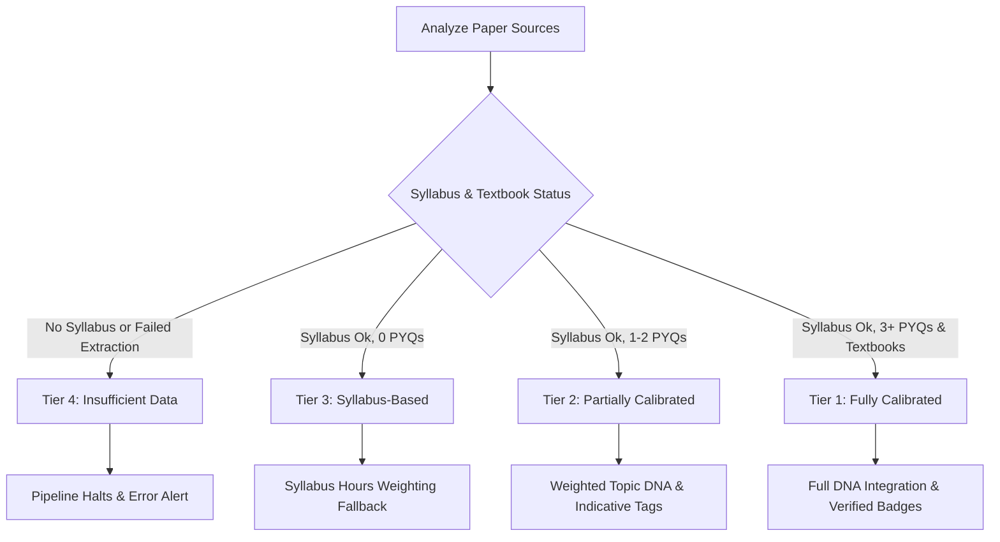

# StudyAI — Product Requirements Document: Phase 4 (AI Prompts & Quality Benchmarks)

This document establishes the definitive Product Requirements Document (PRD) for the AI prompt engineering engine, quality benchmark systems, and trust layer mechanisms of StudyAI. All deprecated chronological build phases, Next.js page scaffolding, and local FastAPI setups are excluded. This document serves as the absolute blueprint for prompt engineering, schema validation, and multi-agent execution constraints.

---

## 1. The Exam-Calibration Philosophy

Unlike generic EdTech summary tools or AI textbooks, StudyAI is engineered with a strict **exam-calibration** philosophy. The core value proposition to Delhi University (DU) B.Sc. students is precision:

> "Every word earns its place. If it is not asked in DU exams, it is not in the notes. If it is in the notes, it will be asked."

### 1.1 Core Tenets of Exam Calibration

1. **Targeted Notes vs. Generic Summaries:** Notes must target specific Delhi University exam patterns rather than acting as generic textbook summaries. The content structure is derived dynamically from historical trends, DU marking schemes, and examiner habits.
2. **Standardization of Instruction Words:** DU question papers are notoriously unstandardized. The pipeline processes historical papers and standardizes variations like `"what is"`, `"define"`, and `"state"` into their canonical forms (e.g., standardizing to `define`). This establishes a consistent "Language DNA" for the topic.
3. **Marks-Calibrated Content Depth:** Content is systematically adjusted based on marks allocation:
   * **2-Mark Priority:** Definition + single worked example only.
   * **3–4 Mark Priority:** Definition + core concept explanation + single example.
   * **6-Mark Priority:** Full comprehensive treatment: definition, core concept explanation, analogy, two worked examples (with edge cases/topic combinations), answer writing technique, common mistakes, and examiner notes.
   * **Never-Asked Priority (Syllabus Only):** Single-line statement: *"On syllabus. Has not appeared in any NEP DU exam. Definition only."*
4. **Exam Pattern Extraction (Paper DNA):** Note generation is powered by historical paper metadata. If Topic DNA shows that eigenvalues are always asked with diagonalisation, or that students lose marks by not stating the characteristic equation explicitly before solving, this context is injected into the notes.

---

## 2. Core Prompt & Content Constraints

To maintain absolute academic authority, all text generated by StudyAI agents must adhere to strict structural constraints.

### 2.1 The Definition Constraint
* **Strict Word Limit:** Every `definition` field must be **under 40 words**.
* **Prerequisite Enforcement:** Definitions must contain **zero undefined terms** that a first-year student would not know, unless they are defined within the prerequisite bridge or the definition itself.
* **Acceptability:** Must be calibrated as a "full-marks" answer for a standard DU 2-mark question.

### 2.2 Mathematical Formatting & Unicode Prohibition
* **Absolute LaTeX Syntax Enforced:** The use of raw unicode mathematical symbols is strictly prohibited. All mathematical notation, variables, operators, and equations must use standard LaTeX delimiters.
* **Syntax Specifications:**
  * **Inline Math:** Use a single dollar sign `$...$` (e.g., `$\varepsilon > 0$`).
  * **Display Math:** Use double dollar signs `$$...$$` (e.g., `$$\boxed{\lambda = 3}$$`).
* **Symbol Enforcement Comparison:**

| Forbidden Unicode Symbol | Mandatory LaTeX Replacement | Output Example |
| :--- | :--- | :--- |
| `ε` (epsilon) | `\varepsilon` | `$\varepsilon$` |
| `λ` (lambda) | `\lambda` | `$\lambda$` |
| `ℕ` (Natural numbers) | `\mathbb{N}` | `$\mathbb{N}$` |
| `ℝ` (Real numbers) | `\mathbb{R}` | `$\mathbb{R}$` |
| `∂` (partial) | `\partial` | `$\partial$` |
| `→` (arrow) | `\to` or `\rightarrow` | `$\to$` |
| `≠` (not equal) | `\neq` | `$\neq$` |
| `√` (square root) | `\sqrt{}` | `$\sqrt{x}$` |

### 2.3 Scratchpad Reasoning Mandate
Before generating any JSON fields, the generation model must execute a mandatory, internal **4-Question Scratchpad Pass** inside its reasoning cycle. These questions are never exposed in the final JSON output:
1. *What is this topic really about in one sentence?*
2. *How does DU actually test this based on Paper DNA?*
3. *What does a full-marks student know that a passing student doesn't?*
4. *What is the single most important thing to communicate?*

---

## 3. The Documentation Tier Classification System

Not all DU B.Sc. papers are equally documented online. To establish credibility, StudyAI utilizes a Tiered Classification System. The pipeline analyzes available materials via a decoder (`tier_classifier.py`) and assigns one of four badges:



### 3.1 Tier Classification Rules & Visual Indicators

#### Tier 1 — Fully Calibrated
* **Criteria:** 3+ NEP Past Year Questions (PYQ) years available, clean text PDF syllabus with high extraction confidence, and the primary prescribed textbook widely available.
* **User-Facing Alert Badge:** `Fully calibrated — based on [X] NEP question papers. All content exam-verified.`
* **Cohort Papers:** Mathematics Sem I-II, Physics Sem I-II, Chemistry Sem I-II, CS Sem I-II.

#### Tier 2 — Partially Calibrated
* **Criteria:** 1–2 NEP PYQ years available, syllabus extracted with medium confidence, and the primary textbook available.
* **User-Facing Alert Badge:** `Partially calibrated — based on [X] NEP question paper(s). Some content estimated from syllabus. Priority tags are reliable. Depth estimates may vary.`
* **Cohort Papers:** Majority of core subjects at launch.

#### Tier 3 — Syllabus-Based
* **Criteria:** 0 NEP PYQ years publicly available, syllabus extracted successfully, and CBCS (pre-NEP) papers available only as a weak signal.
* **User-Facing Alert Badge:** `Syllabus-based — no NEP question papers publicly available for this paper. Content estimated from syllabus and pre-NEP patterns where available. Treat priority tags as indicative, not definitive. Submit your question paper to improve these notes.`
* **Cohort Papers:** Geology, Food Technology, Instrumentation, Polymer Science, and niche combinations.

#### Tier 4 — Insufficient Data
* **Criteria:** 0 NEP PYQs available, syllabus extraction failed or returned low confidence, and no reliable textbook materials.
* **User-Facing Alert Badge:** `Insufficient data — we cannot generate reliable notes for this paper yet. If you have a question paper or syllabus for this UPC, please submit it. Notes will be generated once sufficient source material exists.`
* **Failure Execution Rule:** **The pipeline halts immediately for Tier 4 papers.** No notes are generated, preventing the dissemination of unverified or hallucinated study guidelines.

### 3.2 Depth Signal Hierarchy
When generating topics lacking historical exam papers, the pipeline falls back onto a strict depth signal hierarchy:
1. **NEP PYQ Data:** Ground truth. If present, it overrides all other parameters.
2. **CBCS PYQ Data:** Used as an indicative estimate with the label: *"Estimated from pre-NEP papers — treat as indicative."*
3. **Syllabus Hours Allocation:** More lecture/tutorial hours allocated = more depth. Tagged with: *"Syllabus-based estimate — no exam data available."*

---

## 4. Agent Specifications & Behavioral Guidelines

The core generation pipeline features a strict separation of concerns, orchestrated through two primary components: the **Writer** (Agent 5) and the **Critic** (Agent 8).

### 4.1 Agent 5 — The Writer
* **Model:** Gemini 2.0 Flash
* **Execution Boundary:** One API call per topic (never a batch unit call) to prevent attention degradation and ensure uniform field quality across all topics.

```
Inputs:
├── Topic Syllabus Slice
├── Topic-Specific DNA (Topic, Language, Combination DNA)
├── Topic Concept Bridge (from Agent 4)
├── Adjacent Pre & Post Topics (Context Only)
├── Note Style Category
├── Diagram-Heavy Flag
├── Prescribed Textbook Name
├── split_generation Flag
└── Unique Paper UPC
```

#### Behavioral Guidelines
* **Must Enforce:**
  1. Output only valid JSON matching `topic_schema.json` exactly. No markdown wrapping or conversational preambles.
  2. Format every mathematical statement using KaTeX/LaTeX syntax with `$` and `$$`.
  3. Strict word economy: every sentence must either define, explain, demonstrate, or warn.
  4. Integrate the concept bridge seamlessly to connect this topic to its prerequisite.
  5. Calibrate worked examples to the DU paper style, using units on every intermediate calculation step and wrapping final numerical values in `\boxed{}` math formatting.
  6. Generate a standalone `rapid_revision` block written as if it's the only text a student reads before walking into an exam.
* **Must Not:**
  1. Write about the topic as it appears in a general textbook; must frame content strictly around DU examinations.
  2. Include details untraceable to syllabus inputs or Paper DNA.
  3. Use hedging language (e.g., *"It is interesting to note,"* *"This concept plays a crucial role"*).
  4. Generate SVG source code for complex biological diagrams (must retrieve library paths instead).

#### Failure Modes & Auto-Recovery
* **Schema Validation Failure:** Re-runs the specific topic up to 3 times with incrementally stricter system prompts. If failure persists, renders the field with a regeneration notice: *"This topic encountered a generation error and is being regenerated."* ( halts unit-level completion).
* **Token Limit Overflow:** If a complex topic exceeds 6,000 output tokens, the orchestrator redirects to `split_generation` mode. The topic is split into a **Content Call** (all text fields) and an **Examples Call** (worked problems and PYQs only), which are combined programmatically.
* **LaTeX Syntax Errors:** `latex_formatter.py` attempts auto-correction of structural math elements. If this fails, the raw content is saved and flagged for the Critic's dedicated LaTeX pass.

---

### 4.2 Agent 8 — The Critic
* **Model:** Gemini 2.0 Flash
* **Execution Boundary:** Analyzes one generated topic database entry at a time against a specialized, Delhi University-focused constitutional document (`critic_constitution.txt`).

```
Inputs:
├── Generated Topic Database Entry (Agent 5 Output)
├── DU Constitutional Reference (critic_constitution.txt)
└── Semantic Coverage Gap Flags (Agent 6 Output)
```

#### Behavioral Guidelines
* **Must Enforce:**
  1. Output only valid JSON matching `diff_schema.json`. No general conversational feedback.
  2. Name the exact field path, the specific issue, and the actionable correction.
  3. Rigorously cross-examine generated fields against the DU-specific quality specifications.
  4. Detect and flag any raw unicode math character.
  5. For proof topics, check that the Examiner's Note names the required hypothesis, the expected proof technique, and the most common logical error.
* **Must Not:**
  1. Suggest aesthetic or stylistic choices that do not directly impact DU exam marking criteria.
  2. Flag prerequisite bridges or analogies as irrelevant content (these fields are designed to step outside strict syllabus limits).
  3. Produce more than 10 corrections per topic. If more exist, prioritize corrections based on their marks impact.

#### Failure Modes & Auto-Recovery
* **Diff Schema Validation Failure:** Re-runs the Critic model up to 2 times. If failure persists, the topic bypasses Critic corrections and proceeds directly, logged as a quality gap.
* **Correction Spillover:** If more than 10 corrections are generated, only the 10 highest marks-impact corrections are passed to the patching rewriter. The remaining items are logged for downstream review.

---

## 5. Structured JSON Schemas

Both the Writer and Critic interface via rigid, non-negotiable JSON schemas validated before any database insertion.

### 5.1 Writer Canonical Schema (`topic_schema.json`)

```json
{
  "$schema": "http://json-schema.org/draft-07/schema#",
  "title": "topic_output_schema",
  "description": "Canonical output schema for Agent 5 (Writer). Every topic generated by the Writer must conform to this schema exactly.",
  "type": "object",
  "required": [
    "topic_name",
    "priority",
    "difficulty",
    "rapid_revision",
    "definition",
    "core_concept",
    "examiners_note",
    "common_mistakes",
    "pyqs",
    "quick_checks"
  ],
  "additionalProperties": false,
  "properties": {
    "topic_name": {
      "type": "string",
      "description": "Exact topic name as it appears in the syllabus."
    },
    "priority": {
      "type": "string",
      "enum": ["high", "medium", "low", "never_asked"],
      "description": "Derived from Topic DNA."
    },
    "difficulty": {
      "type": "string",
      "enum": ["easy", "medium", "hard"]
    },
    "estimated_study_minutes": {
      "type": ["integer", "null"],
      "description": "Calibrated to priority and content depth: never_asked: 5. 2-mark: 15. 3-4 mark: 25. 6-mark: 45–60."
    },
    "depth_signal_source": {
      "type": ["string", "null"],
      "enum": ["pyq", "cbcs_estimate", "syllabus_hours", null]
    },
    "rapid_revision": {
      "type": "object",
      "required": [
        "definition_one_line",
        "key_formula_or_concept",
        "examiner_pattern"
      ],
      "additionalProperties": false,
      "properties": {
        "definition_one_line": {
          "type": "string",
          "description": "Under 15 words. DU-acceptable definition with no complex LaTeX."
        },
        "key_formula_or_concept": {
          "type": "string",
          "description": "Single most tested LaTeX expression or concept sentence."
        },
        "examiner_pattern": {
          "type": "string",
          "description": "Exact instruction word DU uses + typical question phrasing."
        }
      }
    },
    "definition": {
      "type": ["string", "null"],
      "description": "Strictly under 40 words. No undefined terms. Math in LaTeX."
    },
    "core_concept": {
      "type": ["string", "null"],
      "description": "Plain language explanation calibrated for DU exams."
    },
    "analogy": {
      "type": ["string", "null"],
      "description": "Factually correct comparison connecting to prerequisite."
    },
    "analogy_verified": {
      "type": ["boolean", "null"]
    },
    "examples": {
      "type": ["array", "null"],
      "items": {
        "type": "object",
        "required": ["type", "content", "steps", "answer"],
        "additionalProperties": false,
        "properties": {
          "type": {
            "type": "string",
            "enum": ["numerical", "theory", "biological"]
          },
          "content": {
            "type": "string",
            "description": "Problem statement."
          },
          "steps": {
            "type": "array",
            "items": {
              "type": "object",
              "required": ["step_number", "step_text"],
              "additionalProperties": false,
              "properties": {
                "step_number": {
                  "type": "integer"
                },
                "step_text": {
                  "type": "string",
                  "description": "LaTeX step text with units shown on intermediate values."
                },
                "units_shown": {
                  "type": ["boolean", "null"]
                }
              }
            }
          },
          "answer": {
            "type": "string",
            "description": "Final answer, wrapped in \\boxed{} display math for numericals."
          },
          "answer_boxed": {
            "type": ["boolean", "null"]
          },
          "common_error": {
            "type": ["string", "null"],
            "description": "Specific error that loses marks in DU exams."
          },
          "verified": {
            "type": "boolean",
            "default": false
          },
          "verification_mode": {
            "type": ["string", "null"],
            "enum": ["numerical_single", "numerical_dual", "proof", "none", null]
          },
          "verification_passed": {
            "type": ["boolean", "null"]
          }
        }
      }
    },
    "diagram_block": {
      "type": ["object", "null"],
      "additionalProperties": false,
      "properties": {
        "diagram_name": {
          "type": "string"
        },
        "svg_source": {
          "type": "string",
          "enum": ["library", "generated"]
        },
        "svg_file_path": {
          "type": ["string", "null"]
        },
        "svg_code": {
          "type": ["string", "null"]
        },
        "labeled_parts": {
          "type": ["array", "null"],
          "items": {
            "type": "object",
            "required": [
              "part_number",
              "part_name",
              "explanation",
              "du_expected_label"
            ],
            "additionalProperties": false,
            "properties": {
              "part_number": {
                "type": "integer"
              },
              "part_name": {
                "type": "string"
              },
              "explanation": {
                "type": "string"
              },
              "du_expected_label": {
                "type": "string",
                "description": "Exact label name sourced from prescribed textbook."
              }
            }
          }
        },
        "marks_value": {
          "type": ["integer", "null"]
        },
        "draw_instructions": {
          "type": ["string", "null"],
          "description": "Step-by-step guide for exams."
        },
        "source_book": {
          "type": ["string", "null"]
        },
        "source_edition": {
          "type": ["string", "null"]
        },
        "source_page": {
          "type": ["integer", "null"]
        }
      }
    },
    "examiners_note": {
      "type": ["string", "null"],
      "description": "PYQ year reference, canonical instruction word, and marking boundaries."
    },
    "examiners_note_pyq_refs": {
      "type": ["array", "null"],
      "items": {
        "type": "string"
      }
    },
    "instruction_word_frequency": {
      "type": ["object", "null"],
      "description": "Frequency map of instruction words from Language DNA."
    },
    "common_mistakes": {
      "type": "array",
      "minItems": 1,
      "maxItems": 3,
      "items": {
        "type": "object",
        "required": ["description", "marks_impact"],
        "additionalProperties": false,
        "properties": {
          "description": {
            "type": "string"
          },
          "marks_impact": {
            "type": "string",
            "description": "Description of marks lost and specific examiner reasoning."
          }
        }
      }
    },
    "answer_writing_technique": {
      "type": ["object", "null"],
      "additionalProperties": false,
      "properties": {
        "applicable": {
          "type": "boolean"
        },
        "min_marks_threshold": {
          "type": "integer",
          "default": 6
        },
        "structure": {
          "type": "array",
          "items": {
            "type": "string"
          },
          "description": "Sentence-by-sentence structural instructions."
        },
        "marks_distribution": {
          "type": "object"
        },
        "word_count_target": {
          "type": ["integer", "null"],
          "description": "~150–200 words for 6-mark theory answers."
        },
        "diagram_expected": {
          "type": ["boolean", "null"]
        }
      }
    },
    "pyqs": {
      "type": "array",
      "items": {
        "type": "object",
        "required": ["year", "marks", "question_text", "instruction_word"],
        "additionalProperties": false,
        "properties": {
          "year": {
            "type": "integer"
          },
          "year_confirmed": {
            "type": ["boolean", "null"]
          },
          "year_confidence": {
            "type": ["string", "null"],
            "enum": ["confirmed", "unconfirmed", null]
          },
          "source": {
            "type": ["string", "null"]
          },
          "marks": {
            "type": "integer"
          },
          "question_text": {
            "type": "string",
            "description": "Verbatim question text."
          },
          "key_steps": {
            "type": ["array", "null"],
            "items": {
              "type": "string"
            }
          },
          "instruction_word": {
            "type": "string"
          },
          "recency_weight": {
            "type": ["number", "null"]
          }
        }
      }
    },
    "quick_checks": {
      "type": "array",
      "minItems": 3,
      "maxItems": 3,
      "items": {
        "type": "string",
        "description": "Self-check question containing no answers."
      }
    },
    "flagged_fields": {
      "type": ["object", "null"]
    }
  }
}
```

### 5.2 Critic Output Schema (`diff_schema.json`)

```json
{
  "$schema": "http://json-schema.org/draft-07/schema#",
  "title": "CriticDiff",
  "description": "Canonical output schema for Agent 8 (Critic). Outputs precise patch directives for individual fields.",
  "type": "object",
  "required": [
    "topic_id",
    "corrections"
  ],
  "properties": {
    "topic_id": {
      "type": "string"
    },
    "corrections": {
      "type": "array",
      "maxItems": 10,
      "description": "Field-level patch array. Prioritized by marks impact.",
      "items": {
        "type": "object",
        "required": [
          "field",
          "issue",
          "correction",
          "severity"
        ],
        "properties": {
          "field": {
            "type": "string",
            "description": "JSON field path e.g. definition, examples[0].steps[2].units_shown, examiners_note"
          },
          "issue": {
            "type": "string",
            "description": "Specific structural or academic issue."
          },
          "correction": {
            "type": "string",
            "description": "Surgical modification string or instructional directive."
          },
          "severity": {
            "type": "string",
            "enum": [
              "critical",
              "major",
              "minor"
            ],
            "description": "critical = marks lost in DU, major = incomplete, minor = polish"
          }
        }
      }
    }
  }
}
```

---

## 6. Verification & Quality Benchmarks

To achieve a bulletproof trust layer, all generated content passes through a strict verification phase following generation.

### 6.1 Verification Modes

1. **Numerical Verification Mode:**
   * Calculated steps are checked by a dedicated Groq Mixtral agent that attempts to solve the problem independently.
   * **Medium/Low Priority Numerical:** Single verification pass.
   * **High Priority Numerical:** **Dual-Verification**. Both Groq Mixtral and Groq Llama 3 solve the problem. They must reach identical numeric values. If they disagree, the problem is flagged as `manual_review: true`, and the student sees a notification banner: *"This example is pending expert review."*
2. **Proof and Derivation Verification Mode:**
   * Handled by Gemini 2.0 Flash for pure mathematics, derivations, and physics proof streams.
   * Evaluates if every step logically follows from the predecessor, verifies all auxiliary theorems/axioms, checks for logical jumps without justification, and ensures concluding boundaries match the initial hypothesis.
3. **Diagram Label Verification Mode:**
   * Checks that all biological parts and expected labels in the generated diagram block exactly match the primary textbook prescribed by DU (e.g., matching spelling variations like *mitochondria* vs *chondriosome* as expected by examiners).

### 6.2 The active recall Strategy
* **Zero Answers in Quick Checks:** The three self-test questions in each topic must **never** contain answers. This is a non-negotiable pedagogical constraint. It forces students into active recall, requiring them to search back through the calibrated content.

---

## 7. Pipeline Failure Handling Specification

StudyAI maps out explicit, robust recovery logic for every agent in the pipeline. Rather than failing silently, each block is isolated:

| Agent / Phase | Breakpoint Failure Scenario | Mandatory Remediation / Recovery Rule |
| :--- | :--- | :--- |
| **Agent 1: Decoder** | UPC not registered | Terminate pipeline immediately. Return clear frontend error: *"This UPC is not in our system yet."* Display button: *"Submit this UPC."* |
| **Agent 1: Decoder** | UPC maps to multiple courses | Return disambiguation prompt to student. Pause execution. If no selection within 10 mins, abort and log. |
| **Agent 2: Researcher** | Syllabus URL 404 | Retry once after 30 seconds. If failing, mark URL broken, send admin alert. Continue with cached syllabus if present. If no cache, halt pipeline, set status to `failed`, notify student. |
| **Agent 2: Researcher** | Scanned PDF OCR below threshold | Force set `syllabus_confidence` to `low`. Downgrade paper to `documentation_tier: 3` immediately, irrespective of PYQ counts. Flag for manual human audit; do not proceed automatically. |
| **Agent 3: Paper DNA** | Normalised PYQ JSON is malformed | Re-run normaliser for that specific paper (max 2 retries). If it continues to fail, exclude that paper from DNA analysis and log `exclusion_reason`. |
| **Agent 3: Paper DNA** | Output fails JSON schema | Re-run Paper DNA (max 2 retries). If failing, proceed without Paper DNA, downgrade paper to `documentation_tier: 3`, and show indicative badge. |
| **Agent 4: Model Mapper** | Dependency cycle detected | Flag the cycle, select the most foundational topic as the entry point, and display a warning banner on all dependent topics. |
| **Agent 5: Writer** | Output JSON fails schema | Re-run Writer for that topic (max 3 retries) with explicit schema constraints. If failing, display regeneration banner and lock unit status. |
| **Agent 5: Writer** | LaTeX syntax errors detected | Attempt auto-correction via `latex_formatter.py`. If correction fails, save raw text and flag for Critic's dedicated LaTeX pass. |
| **Agent 6: Coverage** | Groq API is unavailable | Skip the coverage step. Proceed directly to Agent 8 (Critic). Critic's constitutional document checks will partially compensate. Queue coverage check for future retry. |
| **Agent 7: Verifier** | Groq API is unavailable | Verified badge is omitted (`verified: false`). Example is queued for verify-retry. Student sees no badge. |
| **Agent 7: Verifier** | Verification disagreement | Flag example with `manual_review: true`. Render: *"This example is pending expert review."* |
| **Agent 8: Critic** | Diff output fails schema | Re-run Critic (max 2 retries). If failing, bypass Critic cycle, and proceed to next agent. Log quality gap. |
| **Agent 9: Rewriter** | Output fails patch schema | Revert the field to its pre-rewrite value and flag for manual human review. Apply other successful patches. |
| **Agent 10: Examiner** | Output fails schema | Re-run Examiner (max 2 retries). If failing, proceed with empty uncovered lists, and log quality gap in paper metadata. |
| **Agent 11: Patcher** | Output fails schema | Do not apply patch. Paper continues with whatever the Critic cycle produced. Log gap in metadata. |
| **Agent 12: Consistency**| Major logical/definition conflict | Do not auto-patch. Route affected topics back to Agent 8 (Critic) for surgical correction. |
| **Pipeline-Level** | Mid-pipeline system crash | Retain completed units. Set status to `partial`. Render failed units with `PartialDeliveryNotice`. Attempt to resume from crash point (max 3 retries). |
| **Pipeline-Level** | Realtime socket disconnect | On reconnection, force frontend to poll the database status immediately to capture background generations. |
